# ⚙️ Desenvolvedor de Sistemas 🖥️

Repositório destinado as atividades realizadas no curso de Desenvolvimento de sistemas no SENAC Taguatinga

---
## 🗂️ Material de Apoio

    
 🔗 Conteúdo 

- 📁 <a href="algoritmo/Material/python_aula01.pdf">Lógica & interpretadores </a> 
- 📁 <a href="algoritmo/Material/python_aula02.pdf">Operadores Lógicos </a> 
- 📁 <a href="algoritmo/Material/python_aula03.pdf">Tipos de dados & condicionais </a> 
- 📁 <a href="algoritmo/Material/python_aula04.pdf"> Variáveis & Exercícios</a> 
- 💾 <a href="https://github.com/CrowvenTh/Santander-Python">Repositório de apoio (Python)</a>

### 📋 Banco de Dados 

#### ⚙️ Ferramenta <a href="http://www.sis4.com/brModelo/download.html?authuser=0"> BRModelo </a>

- 💾 <a href="https://github.com/CrowvenTh/senai-lp">Repositório de apoio (SQL)</a>

- 📜 <a href="algoritmo/Material/SQL/AULA 15_SQL BÁSICO.pdf">SQL básico</a>
- 📜 <a href="algoritmo/Material/SQL/SQL Basics Cheat Sheet.pdf">SQL Basics cheat Sheet</a>
- 📜 <a href="algoritmo/Material/SQL/AULA 01 - BANCO DE DADOS INTRODUÇÃO.pdf">BANCO DE DADOS INTRODUÇÃO</a>
- 📜 <a href="algoritmo/Material/SQL/AULA 02 - MODELAGEM DE DADOS.pdf">MODELAGEM DE DADOS</a>
- 📜 <a href="algoritmo/Material/SQL/AULA 03 - MODELO RELACIONAL.pdf">MODELO RELACIONAL</a>
- 📜 <a href="algoritmo/Material/SQL/AULA 04 - MODELO ER.pdf">MODELO ER</a>
- 📜 <a href="algoritmo/Material/SQL/AULA 05 _ CHAVES.pdf">CHAVES</a>
- 📜 <a href="algoritmo/Material/SQL/AULA 06 _ CARDINALIDADE.pdf">CARDINALIDADE</a>
- 📜 <a href="algoritmo/Material/SQL/AULA 07 _ RESTRIÇÕES DE DADOS.pdf">RESTRIÇÕES DE DADOS</a>
- 📜 <a href="algoritmo/Material/SQL/AULA 08 _ DICIONÁRIO DE DADOS.pdf">DICIONÁRIO DE DADOS</a>
- 📜 <a href="algoritmo/Material/SQL/AULA 09_ETAPA CONCEITUAL.pdf">CONCEITUAL</a>
- 📜 <a href="algoritmo/Material/SQL/AULA 10_MIGRAÇÃO MODELO LÓGICO PROJETO CONCEITUAL.pdf">MIGRAÇÃO MODELO LÓGICO PROJETO CONCEITUAL</a>

 
---
  

##  🧮  Aulas

    
 💠 Aula 01 - 🐍 Introdução a python  

 

 10/02/25 

#### upper(): converte todas as letras para maiúsculas
~~~~ python
print(texto.upper())
~~~~

#### lower(): converte todas as letras para minúsculas
~~~~ python
print(texto.lower())
~~~~

#### capitalize(): converte a primeira letra para maiúscula e o restante para minúscula
~~~~ python
print(texto.capitalize())
~~~~

#### strip(): remove espaços em branco do início e do final da string
~~~~ python
print(texto.strip())
~~~~

#### replace(): substitui parte da string por outra
~~~~ python
print(texto.replace("Mundo", "Planeta"))
~~~~

#### sep: não é um método de string, é usado para definir o separador em print
~~~~ python
print("Python", "é", "uma", "linguagem", "fantástica", sep="-")
~~~~

#### count(): conta quantas vezes um determinado elemento aparece na string
~~~~ python
print(texto.count("o"))
~~~~

#### join(): junta os elementos de uma lista em uma única string usando um separador
~~~~ python
lista = ["maçã", "banana", "laranja"]
print(", ".join(lista))
~~~~

#### split(): divide a string em uma lista de substrings usando um separador
~~~~ python
print(texto.split(", "))
~~~~

#### len(): retorna o comprimento da string
~~~~ python
print(len(texto))
~~~~

#### type(): retorna o tipo de dado de uma variável
~~~~ python
print(type(texto))
~~~~

#### round()
~~~~ python
dividendo = 10
divisor = 3
resultado = dividendo / divisor
resultado_arredondado = round(resultado, 2)
~~~~

 10/02/25 

---

    
 💠 Aula 02 - 📝 Exercícios de Lógica I (1 a 12) 

 

 11/02/25 

## Exercício #1 - Olá mundo!

#### imprima na tela a frase "Olá mundo!".    
~~~~ python
#Resolução:
print("olá mundo!")
~~~~

## Exercício #2 - Imprimindo números

#### Crie um programa que imprima os números de 1 até 10.
~~~~ python

numero = [1,2,3,4,5,6,7,8,9,10]
print(numero)

# ou, usando while

numero = 1
while numero <= 10:
    print(numero)
    numero += 1
~~~~

## Exercício #3 - Adição

#### Escreva um programa que calcule a soma de dois números.
~~~~ python
n1 = int(input("Insira o primeiro número: "))
n2 = int(input("Insira o segundo número: "))

print(f"A soma de {n1} + {n2} é igual a {n1+n2}")
~~~~

## Exercício #4 - Multiplicação
#### Escreva um programa que calcule a multiplicação de dois números.
~~~~ python
num1 = 7
num2 = 3

print(f"O resultado de {num1}x{num2} é igual a {num1 * num2}")
~~~~

## Exercício #5 - Divisão
#### Escreva um programa que calcule a Divisão de dois números.
~~~~ python
n1 = 21
n2 = 3

print(f"{n1} dividido por {n2} é igual a {n1 // n2}")
~~~~

## Exercício #6 - Subtração
#### Escreva um programa que calcule a subtração de dois números.
~~~~ python
n1 = int(input("Insira o primeiro numero: "))
n2 = int(input("Insira o segundo numero: "))

print(f"{n1} - {n2} é igual a {n1 - n2}")
~~~~

## Exercício #7 - Indice de string

- [Início:fim:passo] é uma forma de pegar uma parte de uma sequência, como uma string ou lista. Você pode usá-lo para:
  
- Se você usar apenas [::], isso copiará toda a sequência.

- Adicionando um número após o segundo dois pontos (por exemplo, [::2]), você selecionará elementos com um certo intervalo.
  
- Usando [::-1], você pode inverter a sequência.

- Use colchetes [ ] para acessar elementos individuais de uma string por meio de sua posição (índice).

- Lembre-se de que a indexação em Python começa em 0, ou seja, o primeiro caractere de uma string está no índice 0, o segundo no índice 1 e assim por diante.

- Você pode usar índices negativos para contar a partir do final da string. -1 refere-se ao último caractere, -2 ao penúltimo e assim por diante.

---

#### 1 - Dada a string "Python", imprima o primeiro caractere.
~~~~ python
string1 = "python"
print("#1 ", string1[0])
~~~~

#### 2 - Dada a string "Hello, World!", imprima o caractere "W".
~~~~ python
string2 = "Hello, world!"
print("#2 ", string2[-6])
~~~~

#### 3 - Dada a string "Data Science", imprima os três primeiros caracteres.
~~~~ python
string3 = "Data Science"
print("#3 ",string3[:3])
~~~~

#### 4 - Dada a string "Machine Learning", imprima os três últimos caracteres.
~~~~ python
string4 = "Machine Learning"
print("#4 ", string4[-3:])
~~~~

## Exercício #8 - String de indice impar
#### Dada a string "Artificial Intelligence", imprima os caracteres nos índices ímpares.
~~~~ python
string = "Artificial Intelligence"

for i in range(1, len(string), 2):
    print(string[i], end=" ")
    
~~~~

## Exercício #9 - String de indice par
#### Dada a string "Artificial Intelligence", imprima os caracteres nos índices pares.
~~~~ python

string = "Artificial Intelligence"

for i in range(0, len(string), 2):
    print(string[i], end=" ")
    
~~~~

## Exercício #10 - Upper
#### Escreva um programa em Python que utilize a variável texto= "Olá mundo!" e imprima o texto em letras maiúsculas.
~~~~ python
texto = "Olá mundo!"

print(texto.upper())
~~~~

## Exercício #11 - Lower
#### Defina a variável texto com o valor "Olá mundo!".
- Utilize o método lower() para converter todo o texto em letras minúsculas.
- Imprima o texto convertido em letras minúsculas.
~~~~ python
word = "Olá mundo!"

print(word.lower())
~~~~

## Exercício #12 - capitalize
#### Escreva um programa em Python que utilize a variável texto= "olá mundo!" e imprima a primeira letra do texto em maiúscula.
- Defina a variável texto com o valor "olá mundo!".
- Utilize o método capitalize() para capitalizar a primeira letra do texto.
- Imprima o texto capitalizado.

~~~~ python

palavra = "olá mundo"

print(palavra.capitalize())
~~~~

 11/02/25 

    
 💠 Aula 03 - 📝 Exercícios de Lógica II (13 a 21) 

 

 12/02/25 

## Exercício #13 - strip
#### Escreva um programa em Python que remove os espaços em branco do início e do final de uma variável frase =  " Hoje a noite está ótima ". Após remover os espaços em branco do início e do final, exiba o conteúdo da variável frase.

~~~~ python
frase = " Hoje a noite está ótima "
print(frase.strip())
~~~~
#### resultado: 
    Hoje a noite está ótima

## Exercício #14 - Strip & replace
#### Escreva um programa em Python que realize as seguintes operações em uma frase pré-definida:

- A frase fornecida é: " O dia está bom, mas o tempo está chuvoso. "

- Remova quaisquer espaços em branco extras no início e no final da frase.

- Substitua todas as ocorrências da palavra "bom" por "ótimo".

- Ao final, o programa deve exibir a frase sem espaços extras e com as substituições realizadas.

~~~~ python
frase =  " O dia está bom, mas o tempo está chuvoso. "
print(frase.strip().replace("bom", "ótimo"))
~~~~
#### resultado:
    O dia está ótimo, mas o tempo está chuvoso. 

## Exercício #15 - input com String
#### Instruções
O comando input() é usado para receber entrada do usuário em um programa Python. Ele solicita que o usuário insira algum valor a partir do teclado.

Exemplo:
~~~~ python
nome = input("Por favor, insira seu nome: ")
~~~~~
É importante notar que o input() sempre retorna uma string, então se você precisa de um número, deve converter o valor retornado para o tipo numérico apropriado (por exemplo, usando int() ou float()).

    str(valor): Converte o valor para uma string.
    int(valor): Converte uma string em um número inteiro.
    float(valor): Converte o valor para um número de ponto flutuante.

Escreva um programa em Python que solicite ao usuário para inserir seu nome. O programa deve exibir uma mensagem de boas-vindas personalizada, incluindo o nome inserido pelo usuário.

~~~~ python
nome = input("Bem vindo, insira seu nome: ")
print("O nome inserido foi:",nome)
~~~~
#### resultado
    Bem vindo, insira seu nome: Thiago 
    O nome inserido foi:  Thiago

## Exercício #16 - input com adição
#### Instruções
O comando input() é usado para receber entrada do usuário em um programa Python. Ele solicita que o usuário insira algum valor a partir do teclado.

Exemplo:
~~~~ python
nome = input("Por favor, insira seu nome: ")
~~~~
É importante notar que o input() sempre retorna uma string, então se você precisa de um número, deve converter o valor retornado para o tipo numérico apropriado (por exemplo, usando int() ou float()).

    str(valor): Converte o valor para uma string.
    int(valor): Converte uma string em um número inteiro.
    float(valor): Converte o valor para um número de ponto flutuante.

Escreva um programa em Python que peça ao usuário para inserir dois números e calcule a soma desses números. Em seguida, exiba o resultado da soma.

~~~~ python
n1 = int(input("Insira o primeiro numero: "))
n2 = int(input("Insira o segundo numero: "))
soma = (n1 + n2)

print(f"{n1} + {n2} é igual a {soma}")
~~~~
#### resultado:
    Insira o primeiro numero: 21
    Insira o segundo numero: 7
    21 + 7 é igual a 28

## Exercício #17 - input com subtração
#### Instruções
O comando input() é usado para receber entrada do usuário em um programa Python. Ele solicita que o usuário insira algum valor a partir do teclado.

Exemplo:
~~~~ python
nome = input("Por favor, insira seu nome: ")
~~~~
É importante notar que o input() sempre retorna uma string, então se você precisa de um número, deve converter o valor retornado para o tipo numérico apropriado (por exemplo, usando int() ou float()).

    str(valor): Converte o valor para uma string.
    int(valor): Converte uma string em um número inteiro.
    float(valor): Converte o valor para um número de ponto flutuante.

Escreva um programa em Python que peça ao usuário para inserir dois números e calcule a subtração do segundo número pelo primeiro. Em seguida, exiba o resultado da subtração.

~~~~ python
n1 = int(input("Insira o primeiro número: "))
n2 = int(input("Insira o segundo número: "))
sub = (n1 - n2)

print(f"{n1} - {n2} é igual a {sub}")
~~~~
#### resultado:
    Insira o primeiro número: 28
    Insira o segundo número: 7
    28 - 7 é igual a 21

## Exercício #18 - input com divisão e arredondamento
#### Instruções
O comando input() é usado para receber entrada do usuário em um programa Python. Ele solicita que o usuário insira algum valor a partir do teclado.

Exemplo:
~~~~ python
nome = input("Por favor, insira seu nome: ")
~~~~

É importante notar que o input() sempre retorna uma string, então se você precisa de um número, deve converter o valor retornado para o tipo numérico apropriado (por exemplo, usando int() ou float()).

    str(valor): Converte o valor para uma string.
    int(valor): Converte uma string em um número inteiro.
    float(valor): Converte o valor para um número de ponto flutuante.

Escreva um programa em Python que peça ao usuário para inserir dois números e calcule a divisão do primeiro número pelo segundo número. Certifique-se de verificar se o segundo número não é zero antes de realizar a divisão. Em seguida, exiba o resultado da divisão.

    #Arredondar
    dividendo = 10
    divisor = 3
    resultado = dividendo / divisor

    resultado_arredondado = round(resultado, 2)

    print("O resultado da divisão é:", resultado_arredondado)

~~~~ python
n1 = float(input("Insira o primeiro número: "))
n2 = float(input("Insira o segundo número: "))

divArredondada = round(n1 / n2, 2)

print(f"{n1} dividido por {n2} é igual a {divArredondada}")
~~~~
#### resultado :
    Insira o primeiro número: 21.0
    Insira o segundo número: 3.0
    21 dividido por 3 é igual a 7.0

## Exercício #19 - input com multiplicação
#### Instruções
O comando input() é usado para receber entrada do usuário em um programa Python. Ele solicita que o usuário insira algum valor a partir do teclado.

Exemplo:
~~~~ python
nome = input("Por favor, insira seu nome: ")
~~~~

É importante notar que o input() sempre retorna uma string, então se você precisa de um número, deve converter o valor retornado para o tipo numérico apropriado (por exemplo, usando int() ou float()).

            str(valor): Converte o valor para uma string.
            int(valor): Converte uma string em um número inteiro.
            float(valor): Converte o valor para um número de ponto flutuante.

Escreva um programa em Python que peça ao usuário para inserir dois números reais e calcule o produto desses números. Em seguida, exiba o resultado da multiplicação.

~~~~ python
number1 = int(input("Insira o primeiro número: "))
number2 = int(input("Insira o segundo número: "))
produto = (number1 * number2)

print(f"{number1} X {number2} é igual a {produto}")
~~~~
#### resultado:
    Insira o primeiro número: 7
    Insira o segundo número: 3
    7 x 3 é igual a 21

## Exercício 20 - sep data
#### Escreva um programa em Python que solicite ao usuário informações sobre uma data (dia, mês e ano) e utilize o parâmetro sep na função print() para imprimir a data no formato "DD/MM/AAAA".
    Dia = 10
    Mês = 5
    Ano = 2014
    Exemplo: print(a , b , c ,sep='-')

~~~~ python
day = int(input("Insira o dia: "))
month = int(input("Insira o mês: "))
year = int(input("Insira o ano: "))

print(day, month, year, sep="/")

~~~~
#### resultado:
    Insira o dia: 12
    Insira o mês: 02
    Insira o ano: 2025
    12/2/2025

## Exercício #21 - sep pessoa
#### Escreva um programa em Python que use o parâmetro sep na função print() para imprimir o nome, idade e altura de uma pessoa separados por um hífen.

~~~~ python
nome = str(input("Insira seu nome: "))
idade = int(input("Insira sua idade: "))
altura = float(input("Insira sua altura: "))

print(f"{nome} - {idade} - {altura}")
~~~~
#### resultado:
    Insira seu nome: Fulano
    Insira sua idade: 25
    Insira sua altura: 1.75
    Fulano - 25 - 1.75

 

 12/02/25 

    
 💠 Aula 04 - 📝 Exercícios de Lógica III (22 a 26) 

 

 13/02/25 

## Exercício #22 - join
### 1 - Crie um programa em Python que aceite uma TUPLA de linguagens de programação e as junte em uma única String separada por hífens, verificar o tipo da variável antes e após a operação:

### Tupla -  É uma sequência de valores ordenados e imutáveis
~~~~ python
tupla = "Python", "Java", "C#", "C++", "PHP"
~~~~

#### resolução:
~~~~ python
tupla = "Python", "Java", "C#", "PHP"
print(tupla)
print(type(tupla))
tupla_join = "-".join(tupla)
print(tupla_join)
print(type(tupla_join))
~~~~
#### resultado: 
    ('Python', 'Java', 'C#', 'PHP')
    <class 'tuple'>
    Python-Java-C#-PHP
    <class 'str'>

### 2 - Crie um programa em Python que aceite uma Lista de linguagens de programação e as junte em uma  String separada por hífens, verificar o tipo da variável antes e após a operação: 

#### Lista -  É uma sequência de valores ordenados e mutáveis
~~~~ python
lista= ["Python", "Java", "C#", "C++", "PHP"]
~~~~ 

#### resolução:
~~~~ python
lista = ["Python", "Java", "C#", "PHP"]
print(lista)
print(type(lista))
lista_join = " - ".join(lista)
print(lista_join)
print(type(lista_join))
~~~~
#### resultado:
    ['Python', 'Java', 'C#', 'PHP']
    <class 'list'>
    Python - Java - C# - PHP
    <class 'str'>

### Instruções
Defina uma lista de linguagens de programação.
Utilize o método join() para juntar os elementos da lista/tupla em uma única String, separados por hífens.  

~~~~ python
x = " - ".join(lista)
~~~~
Imprima as Strings resultantes.

Para verificar o tipo de uma variável em Python, você pode usar a função embutida type(). Aqui está um exemplo:
~~~~ python
variavel = "Olá, mundo!"
print(type(variavel))  # Saída: <class 'str'>
~~~~

## Exercício 23 - Split
#### Escreva um programa em Python que aceite uma sequência de linguagens de programação separadas por espaços. O programa deve dividir essa sequência em uma lista de linguagens individuais e imprimir a lista resultante. Ao final imprimir o tipo da variável.
~~~~ python
Linguagens  - "Python,Java,C#,C++,PHP"
~~~~~
Utilize o método split() para dividir a sequência em uma lista. split(", ")

    Split(",") - Determina o marcador de separação de palavras para compor lista

## ou 

~~~~ python
Linguagens  - "Python Java C# C++ PHP"
~~~~
Utilize o método split() para dividir a sequência em uma lista. split(" ")

    Split( ) - Determina o marcador de separação de palavras para compor lista

Imprima a lista resultante.

#### resolução:
~~~~ python
Linguagens = "Python Java C# C++ PHP"
l = Linguagens.split(" ")
print(l)
~~~~
### resultado:
    ['Python', 'Java', 'C#', 'C++', 'PHP']

## Exercício #24 - len
#### Escreva um programa que solicite ao usuário para inserir uma palavra e imprima o número de caracteres na palavra, utilizando a função len().

Exemplo de saída:
~~~~ python
x = len(variável)
Digite uma palavra: Python
A palavra tem 6 caracteres.
~~~~ 

~~~~ python
var = str(input("Escreva uma palavra: "))

print(f"A palavra {var} tem {len(var)} caracteres")
~~~~
#### resultado:
    A palavra antonio tem 7 caracteres

## Exercício #25 - Lista []
#### Crie um programa que receba a lista abaixo e imprima a linguaguem de programação:
~~~~ python
lista: ["Python","Java","C#","C++","PHP"]
print(lista[índice])
~~~~

#### resolução:
~~~~ python
lista = ["Python","Java","C#","C++","PHP"]
print(lista[1])
~~~~
#### resultado:
    Java

## Exercício #26 - Tupla
#### Crie um programa que receba a tupla abaixo e imprima a linguem de programação: C++

    tupla: "Python","Java","C#","C++","PHP"

#### resolução: 
~~~~ python
tupla = "Python","Java","C#","C++","PHP"
print(tupla[3])
~~~~
#### resultado:
    C++

 

 13/02/25 

    
 💠 Aula 05 - 📝 Exercícios de Lógica IV (27 a 35) 

 

 14/02/25 

## Exercício #27 - Format()
#### Escreva um programa em Python que utilize o método format() para formatar uma mensagem com informações pessoais. Você deve criar um dicionário chamado informacoes com as seguintes chaves e valores:

    Nome: "Ana"
    Idade: 35
    Cidade: "São Paulo"

Em seguida, utilize o método format() para imprimir uma mensagem no seguinte formato: "Olá, meu nome é [Nome], tenho [Idade] anos e moro em [Cidade].", onde [Nome], [Idade] e [Cidade] são espaços reservados que devem ser substituídos pelas informações contidas no dicionário informacoes.
Código Python que utiliza o método format() para formatar uma mensagem com informações pessoais:

    nome = "João"
    idade = 30

 Utilizando format() para inserir valores em uma string

    mensagem = "Olá, meu nome é {} e tenho {} anos.".format(nome, idade)
    print(mensagem)

### resolução: 
~~~~ python
Nome = input("Insira seu nome: ")
Idade = int(input("Insira sua idade: "))
Cidade = str(input("Digite uma cidade: "))

mensagem = "Olá, meu nome é {} e tenho {} anos, e moro em {}".format(Nome, Idade, Cidade)
print(mensagem)
~~~~

#### resultado: 
    Insira seu nome: Thiago
    Insira sua idade: 20
    Digite uma cidade: Belém
    Olá, meu nome é Thiago e tenho 20 anos, e moro em Belém

## Exercício #28 - Format() II
#### Escreva um programa em Python que utilize o método format() para formatar uma mensagem com informações sobre um livro. Você deve criar variáveis para armazenar as seguintes informações:
- Título do livro: "O Pequeno Príncipe"
- Autor do livro: "Antoine de Saint-Exupéry"
- Ano de publicação: 1943
- Preço do livro (em reais): 39.90
Em seguida, utilize o método format() para imprimir uma mensagem no seguinte formato: "'{}' é um livro escrito por {}. Foi publicado em {} e custa R${}.". Substitua os espaços reservados pelos valores correspondentes das variáveis.

#### Definição de casas decimais
    
    print("A média das notas é: {:.2f}".format(media))

- : Indica o início da especificação de formatação.
- .2: Especifica o número de casas decimais que você deseja manter após o ponto decimal. No caso, .2 significa que você quer manter duas casas decimais.
- f: Indica que o valor a ser formatado é um número decimal (float).

### resolução: 
~~~~ python
lTitulo = "The witcher"
lAutor = "Andrzej Sapkowski"
anoPublicacao = 1990
lPreco = 79.90

livro = "'{}' é um livro escrito por {}. Foi publicado em {} e custa R${}.".format(lTitulo, lAutor, anoPublicacao, lPreco)
print(livro)
~~~~

#### resultado: 
    'The witcher' é um livro escrito por Andrzej Sapkowski. Foi publicado em 1990 e custa R$79.9.

## Exercício #29 - Format() III
#### Escreva um programa em Python que utilize o método format() para formatar uma mensagem com informações sobre um produto. Você deve criar variáveis para armazenar as seguintes informações:
    
    Nome do produto: "Camiseta"
    Preço do produto: R$29.99
    Quantidade disponível: 100

Em seguida, utilize o método format() para imprimir uma mensagem no seguinte formato: 
    
    "Produto: [Nome], Preço: R$[Preço], Quantidade disponível: [Quantidade]. O valor total do estoque é R$[ValorEstoque]."

.Onde [Nome], [Preço] e [Quantidade] são espaços reservados que devem ser substituídos pelas informações corretas. Além disso, [ValorEstoque] representa o valor total do estoque, calculado multiplicando o preço pela quantidade disponível.

### resolução: 
~~~~ python
nomeProduto = "Camiseta"
precoProduto = 29.99
qtd = 100
valorEstoque = precoProduto * qtd

mensagem = "Produto: {}, Preço: R${}, Quantidade disponível: {}. O valor total do estoque é R${}.".format(nomeProduto, precoProduto, qtd, valorEstoque)
print(mensagem)
~~~~

#### resultado: 
    Produto: Camiseta, Preço: R$29.99, Quantidade disponível: 100. O valor total do estoque é R$2999.0.

## Exercício #30 - F-String
#### Peça ao usuário para inserir seu nome. Em seguida, use uma f-string para exibir uma mensagem de saudação personalizada.

Solicita ao usuário que insira seu nome
    
    nome = input("Digite seu nome: ")

Exibe uma mensagem de saudação personalizada usando uma f-string

    mensagem = f"Olá, {nome}! Bem-vindo ao nosso programa."
    print(mensagem)

Casas decimais f" {valor:.2f}"

### resolução: 
~~~~ python
nome = input("Insira seu nome: ")
print(f"Olá {nome}, seja bem vindo!")
~~~~

#### resultado: 
    Insira seu nome: Thiago
    Olá Thiago, seja bem vindo!
    
## Exercício #31 - f-string pessoa 
#### Peça ao usuário para inserir seu nome, idade e cidade. Em seguida, use uma f-string para exibir essas informações formatadas.
    
    nome = "João"
    idade = 30
    Cidade="Brasília"

### resolução: 
~~~~ python
nome =  input("insira seu nome: ")
idade = input("insira sua idade: ")
Cidade =  input("insira sua cidade: ")

print(f"Seu nome é {nome}, sua  idade é {idade} e você mora em {Cidade}")
~~~~

#### resultado: 

    insira seu nome: Thiago
    insira sua idade: 20
    insira sua cidade: Belém
    Seu nome é Thiago, sua  idade é 20 e você mora em Belém
    
## Exercício #32 - condicional IF, ELSE
#### Utilizando if e else em Python:

    if condição:
        # Código a ser executado se a condição for verdadeira
    else:
        # Código a ser executado se a condição for falsa

Em Python, a indentação é fundamental para definir o bloco de código dentro das estruturas de controle. O código dentro do bloco if e else deve ser indentado para indicar que ele está condicionado àquela estrutura.

Os operadores de comparação (==, !=, <, >, <=, >=) são usados para comparar valores. Eles retornam True se a comparação for verdadeira e False caso contrário.

Você pode usar operadores lógicos (and, or, not) para combinar múltiplas condições em uma única instrução if.

Escreva um programa que solicite ao usuário para inserir dois números inteiros. O programa deve então verificar qual número é maior e imprimir uma mensagem correspondente.
    
### resolução: 
~~~~ python
num1 = int(input("Insira um número: "))
num2 = int(input("Insira outro número: "))

if num1 > num2:
    print(f"{num1} é maior que {num2}")
elif(num1 == num2):
    print(f"{num1} é igual a {num2}")
else: 
    print(f"{num1} é menor que {num2}")
~~~~

#### resultado: 
    
    Insira um número: 21
    Insira outro número: 07
    21 é maior que 7

## Exercício #33 - Número positivo
#### Escreva um programa em Python que verifique se um número é positivo.

#### resolução:
~~~~ python
num = int(input("Insira um número: "))

if num > 0:
    print(num, "é número positivo")
elif num == 0:
    print(num, "é número neutro")
else:
    print(num, "é número negativo")
~~~~

#### resultado:
    Insira um número: 21
    21 é número positivo
## Exercício #34 - Maior Idade
#### Crie um programa que verifique se uma pessoa pode votar com base em sua idade (idade >= 16).

#### resolução: 
~~~~ python
idade = int(input("Insira sua idade: "))

if(idade >= 18):
    print("Você é maior de idade!")
else:
    print("Você é menor de idade!")
~~~~

#### resultado:
    Insira sua idade: 16
    Você é menor de idade!

# Exercício #35 - Par ou Impar
#### Crie um programa que determine se um número é par ou ímpar.
    Instrução
    resultado = 10 % 3 
    print(resultado) # Saída será 1, porque 10 dividido por 3 é igual a 3 com um resto de 1

#### resolução:
~~~~ python
number = int(input("insira um número: "))

if(number % 2 == 0):
    print("O número",number,"é par!")
else: 
    print("O número",number,"é impar!")
~~~~

#### resultado:
    insira um número: 21
    O número 21 é impar!

 

 14/02/25 

    
 💠 Aula 06 - 📝 Exercícios de Lógica V (36 a 41) 

 

 17/02/25 

## Exercício #36 - If upper
#### Escreva um programa que verifique se uma palavra está toda em letras maiúsculas.

#### resolução:
~~~~ python
word = input("Insira uma palavra: ")

if word == word.upper(): #ou if word.isupper():
    print("A palavra está em letras maiúsculas")
else:
    print("A palavra está em letras minúsculas")
~~~~

#### resultado:
    Insira uma palavra: THIAGO
    A palavra está em letras maiúsculas
OU se a validação do IF for falsa:

    Insira uma palavra: thiago
    A palavra está em letras minúsculas

## Exercício #37 - Count()
#### Faça um programa que transforme um texto todo em letras maiúsculas e conte quantas letras 'A' ele possui.

#### resolução:
~~~~ python
palavra = input("Insira uma palavra: ")

print(palavra.upper().count("A"))

# Outro jeito de fazer:
palavra = input("Insira uma palavra: ").upper()
contagem = palavra.count("A")
if contagem > 0:
    print(f"a palavra {palavra} contém {contagem} letras 'A'")
else: 
    print(f"a palavra {palavra} contém {contagem} letras 'A'")
~~~~
#### resultado:
    Insira uma palavra: banana 
    3

resolução da segunda forma:

    Insira uma palavra: banana
    a palavra BANANA contém 3 letras 'A'

## Exercício #38 - lowerCase
#### Escreva um programa que verifique se uma palavra está toda em letras minúsculas.

#### resolução:
~~~~ python
palabra = str(input("Insira uma palavra: "))

if(palabra.islower()):
    print(f"A palavra {palabra} está escrita em letras minúsculas!")
else:
    print(f"A palavra {palabra} está escrita em letras maiúsculas!")
~~~~

#### resultado:
    Insira uma palavra: banana 
    A palavra banana está escrita em letras minúsculas!

OU se a validação do IF for falsa:

    Insira uma palavra: BANANA
    A palavra BANANA está escrita em letras maiúsculas!

## Exercício #39 - Lower() & count()
#### Faça um programa que transforme um texto todo em letras minúsculas e conte quantas letras 'e' ele possui.

#### resolução:
~~~~ python
texto = input("Digite um texto: ").lower()
contE = texto.count("e")
if contE > 0:
    print(f"O texto '{texto}' contém {contE} letras 'e' ")
else: 
    print(f"O texto '{texto}' contém {contE} letras 'e' ")
~~~~
#### resultado:
    Digite um texto: Pelo futuro do conhecimento
    O texto 'pelo futuro do conhecimento' contém 3 letras 'e' 

## Exercício #40 Desafio - palindromo
#### Crie um programa que verifique se um palavra é um palíndromo(Igual, quando lida de trás para frente).

#### resolução:
~~~~ python
palavra = input("escreva uma palavra: ")

if palavra == palavra[::-1]:
    print(f"A palavra {palavra} é um palíndromo")
else:
    print(f"A palavra {palavra} não é um palíndromo")
~~~~
#### resultado:
    escreva uma palavra: ovo
    A palavra ovo é um palíndromo

    # se não:

    escreva uma palavra: caqui
    A palavra caqui não é um palíndromo

## Exercício #40 - If capitalize()
#### Crie um programa que verifique se a primeira letra é maiúscula, caso não seja, capitalize a primeira letra de uma palavra.

#### resolução:
~~~~ python
palavra = input("Digite uma palavra: ")

if palavra != palavra.capitalize():
    print(palavra.capitalize())
~~~~
#### resultado:
    Digite uma palavra: cachorro
    Cachorro

## Exercício #41 - Elif()
#### 

    if condição_externa:
        # Código a ser executado se a condição externa for verdadeira
        if condição_interna:
            # Código a ser executado se a condição interna for verdadeira
        else:
            # Código a ser executado se a condição interna for falsa
    else:
        # Código a ser executado se a condição externa for falsa

Ou

    if condição_1:
        # Código a ser executado se condição_1 for verdadeira
    elif condição_2:
        # Código a ser executado se condição_1 for falsa e condição_2 for   verdadeira
    else:
        # Código a ser executado se nenhuma das condições anteriores for    verdadeira

#### resolução:
~~~~ python
numero = int(input("Digite um número: "))

if numero > 0:
    print("é número positivo")
elif numero < 0:
    print("é número negativo")
else: 
    print("é número neutro")
~~~~
#### resultado:
se a variavel for maior que 0

    Digite um número: 7
    é número positivo

se a variavel for menor que 0
    
    Digite um número: -1
    é número negativo

se a variavel for igual a 0
    
    Digite um número: 0
    é número neutro

 

 17/02/25 

   
 💠 Aula 07 - 📝 Exercícios de Lógica VI (42 a 49) 

 

 18/02/25 

## Exercício #42 - Média de notas
#### Crie um programa que receba 4 notas de um aluno e calcule a média:
- Nota >= 6 Aprovado
- Nota < 6 e nota > 4 Recuperação
- Nota <= 4 Reprovado

#### resolução:
~~~~ python

count = 0
notaTotal = 0
while count < 4:
        nota = 0
        count += 1
        nota = float(input(f"Insira a {count}° nota: "))
        notaTotal += nota
        if(count == 4):
                media = (notaTotal / count)
                print(f"A média das nota é: {media:.1f}")
                if(media >= 6):
                        print("O aluno está aprovado!")
                elif(media < 6 and media > 4):
                        print("O aluno está de recuperação!")
                else:
                        print("O aluno está reprovado!")
~~~~
#### resultado:
Primeira validação do IF:

    Insira a 1° nota: 8.7
    Insira a 2° nota: 8.9
    Insira a 3° nota: 7.6
    Insira a 4° nota: 8.8
    A média das nota é: 8.5
    O aluno está aprovado!

Segunda validção ELIF:

    Insira a 1° nota: 6.4
    Insira a 2° nota: 5.7
    Insira a 3° nota: 6.1
    Insira a 4° nota: 3.8
    A média das nota é: 5.5
    O aluno está de recuperação!

Terceira validação ELSE:

    Insira a 1° nota: 2.3
    Insira a 2° nota: 4.6
    Insira a 3° nota: 5.0
    Insira a 4° nota: 1.6
    A média das nota é: 3.4
    O aluno está reprovado!

## Exercício #43 - Positivo & impar 
#### Escreva um programa em Python que determine se um número digitado pelo usuário é um número positivo e ímpar.

#### resolução:
~~~~ python
numero = int(input("Insira um número: "))

if(numero % 2 != 0 and numero > 0):
    print(f"O número {numero} é impar e positivo")
elif(numero % 2 != 0 and numero < 0):
    print(f"O número {numero} é impar e negativo")
elif(numero % 2 == 0 and numero < 0):
    print(f"O número {numero} é par e negativo")
else:
    print(f"O número {numero} é par e positivo")
~~~~
#### resultado:
    Insira um número: 7
    O número 7 é impar e positivo
    ---
    Insira um número: -7
    O número -7 é impar e negativo
    ---
    Insira um número: -4
    O número -4 é par e negativo
    ---
    Insira um número: 4
    O número 4 é par e positivo

## Exercício #44 - isalpha() 
#### Escreva um programa em Python que determine se uma palavra digitada pelo usuário somente contém letras, caso contenha algum valor numérico, informar que não contem apenas letras ou nenhuma letra.
    texto.isalpha()
- Ele retorna True se todos os caracteres são letras e False se pelo menos um caractere não for uma letra.

#### resolução:
~~~~ python
ut("Digite uma palavra: ")

if(palavra.isalpha()):
    print(f"A palavra '{palavra}' contém apenas letras")
elif(palavra == ""):
    print(f"A palavra não foi digitada")
else: 
    print(f"A palavra '{palavra}' não contém apenas letras")
~~~~
#### resultado:
    Digite uma palavra: thiago
    A palavra 'thiago' contém apenas letras
    ---
    Digite uma palavra: 
    A palavra não foi digitada
    ---
    Digite uma palavra: 721
    A palavra '721' não contém apenas letras

## Exercício #45 - isdigit()
#### Escreva um programa em Python que determine se os números  digitados pelo usuário contém somente números, caso contenha algum valor não numérico, informar que é permitido somente números
    numeros.isdigit()
verificar se todos os caracteres na frase são dígitos de (0 a 9). Se todos os caracteres forem dígitos, a função retorna True, caso contrário, retorna False.

#### resolução:
~~~~ python
numero = input("digite um número: ")

if(numero == ""):
    print("nenhum número foi digitado")
elif(numero.isdigit()):
    print(f"o número digitado foi {numero}")
else:
    print(f"valor inválido o número não deve conter letras")
~~~~
#### resultado:
    digite um número: 
    nenhum número foi digitado
    ---
    digite um número: 21
    o número digitado foi 21
    ---
    digite um número: thiago
    valor inválido o número não deve conter letras

## Exercício #46 WHILE - Contagem progressiva while()
#### Escreva um programa que conte de 1 a 10 usando um loop while e imprima cada número.
    while condição: 
        # Código a ser executado enquanto a condição for verdadeira

#### resolução:
~~~~ python
contador = 0
while contador < 10:
    contador += 1 # nessa posição o contador vai do 10 ao 1
    print(contador)
    # contador += 1 nessa posição o contador vai do 0 ao 9

# OU
    
for i in range(1, 11, +1):
    print(i)
~~~~
#### resultado:
    1
    2
    3
    4
    5
    6
    7
    8
    9
    10

## Exercício #47 WHILE - Contagem Regressiva while()
#### Escreva um programa faça a contagem regressiva de 1 a 10 usando um loop while e imprima cada número.

while condição: 
      # Código a ser executado enquanto a condição for verdadeira

#### resolução:
~~~~ python
contador = 10
while contador > 0:
    # contador -= 1 nessa posição o contador vai do 9 ao 0
    print(contador)
    contador -= 1 # nessa posição o contador vai do 10 ao 1
~~~~
#### resultado:
    10
    9
    8
    7
    6
    5
    4
    3
    2
    1

# Exercício #48 WHILE - contagem de pares
#### Escreva um programa que solicite ao usuário um número e depois imprima todos os números pares de 1 até esse número, usando um loop while

#### resolução:
~~~~ python

numero = int(input("Insira um número: "))
contador = 0
while contador < numero:
    contador += 2
    print(contador)

# ou 

numero = int(input("Insira um número: "))
contador = 0
while contador < numero:
    if (contador % 2 == 0):
        print(contador)
    contador += 1
~~~~
#### resultado:
    Insira um número: 10
    2
    4
    6
    8
    10

## Exercício #49 WHILE - contagem de par regressivo
#### Escreva um programa que solicite ao usuário um número e depois imprima todos os números pares de 1 até esse número, imprimir em ordem decresce, usando um loop while.

#### resolução:
~~~~ python
numero = int(input("Insira um número: "))
contador = numero

while (contador > 0):
    if(contador % 2 == 0):
        print(contador)
    contador -= 1
~~~~

#### resultado:
    Insira um número: 10
    10
    8
    6
    4
    2

 

 18/02/25 

    
 💠 Aula 08 - 📝 Exercícios de Lógica VII (50 a 53) 🧮 WHILE

 

 19/02/25 

## Exercício #50 WHILE - tabuada com while
#### Escreva um programa que imprima a tabuada de multiplicação de um número específico até 10, usando um loop while.

#### resolução:
~~~~ python
numero = int(input("Insira um número: "))
cont = 0

while cont <= 10:
    print(f"{numero} x {cont} = {numero * cont}")
    cont +=1
~~~~

#### resultado:
    Insira um número: 2
    2 x 0 = 0
    2 x 1 = 2
    2 x 2 = 4
    2 x 3 = 6
    2 x 4 = 8
    2 x 5 = 10
    2 x 6 = 12
    2 x 7 = 14
    2 x 8 = 16
    2 x 9 = 18
    2 x 10 = 20

## Exercício #51 WHILE - validação de senha simples
#### Escreva um programa que solicite ao usuário que insira uma senha correta e continue pedindo até que a senha correta seja inserida, usando um loop while.
#### resolução:
~~~~ python
senha = input("Cadastre sua senha: ")
userSenha = input("Digite sua senha: ")

while True:
    if(senha != userSenha):
        print("Senha incorreta!")
        userSenha = input("Digite sua senha: ")
    else: 
        print("Senha Correta!")
        break
~~~~

#### resultado:
    Cadastre sua senha: thigs
    Digite sua senha: 123
    Senha incorreta!
    Digite sua senha: thigs
    Senha Correta!

## Exercício #52 WHILE - soma acumulada
#### Escreva um programa que solicite ao usuário que insira números e calcule a soma desses números até que a soma ultrapasse um limite específico, usando um loop while

#### resolução:
~~~~ python
on = True
somaIterada = 0
limite = int(input("Insira um resultado limite: "))
while on:
    numero = int(input("Insira um número: "))
    numero1 = int(input("Insira outro número: "))
    soma = (numero + numero1)
    somaIterada += soma
    if(somaIterada < limite):
            print(f"{somaIterada} 🧮 {limite}")
    if(somaIterada > limite):
        print(f"{somaIterada} 🧮 {limite}")
        on = False
~~~~

#### resultado:
    Insira um resultado limite: 10
    Insira um número: 5
    Insira outro número: 5
    Insira um número: 1
    Insira outro número: 1
    12 🧮 10

## Exercício #53 WHILE Desafio II - Random()
#### Escreva um programa em Python que solicite ao usuário para adivinhar um número entre 1 e 100. O programa deve continuar pedindo um palpite até que o usuário adivinhe corretamente o número. O programa deve fornecer dicas se o palpite estiver muito alto ou muito baixo

### Instruções

Para usar as funções e recursos de uma biblioteca em Python, você precisa primeiro  importá-la para o seu script ou programa. 

A importação é feita usando a palavra-chave: 'import' , seguida do nome da biblioteca.
    
    import random
    
Depois de importar a biblioteca, você pode chamar suas funções e recursos em seu    programa. Isso é feito usando a sintaxe nome_da_biblioteca.

    nome_da_função().
    numero_aleatorio =  random.randint(1, 100)  
    import random

### Função random()

Esta função retorna um número de ponto flutuante aleatório no intervalo [0.0, 1.0),incluindo 0.0, mas excluindo 1.0.

    numero_aleatorio = random.random()
    print("Número aleatório (random()):", numero_aleatorio)

### Função randint(a, b)

Esta função retorna um número inteiro aleatório no intervalo [a, b], incluindo ambos  os extremos.

    numero_aleatorio = random.randint(1, 100)
    print("Número inteiro aleatório (randint(1, 100)):", numero_aleatorio)

### Função choice(seq)

Esta função retorna um elemento aleatório de uma sequência não vazia.

    lista = ['maçã', 'banana', 'laranja', 'uva']
    escolha_aleatoria = random.choice(lista)
    print("Escolha aleatória de uma lista (choice(lista)):", escolha_aleatoria)

#### resolução:
~~~~ python
import random

randomNumber = random.randint(1, 100)
print(randomNumber)
numero = int(input("Adivinhe o número: "))

while True:
    if(randomNumber > numero):
        print("Número incorreto, tente um palpilte maior")
    elif(randomNumber < numero):
        print("Número incorreto, tente um palpilte menor")
    elif(randomNumber == numero):
        print(f"{randomNumber}, número correto!")
        break
    numero = int(input("Adivinhe o número: "))
~~~~

#### resultado:
    Adivinhe o número: 50
    Número incorreto, tente um palpilte menor
    Adivinhe o número: 20
    Número incorreto, tente um palpilte maior
    Adivinhe o número: 24
    24, número correto!

 19/02/25 

    
 💠 Aula 09 - 📝 Exercícios de Lógica VIII (54 a 57) 🧮 WHILE 

 

 20/02/25 

## Exercício #53 WHILE - menu simples
#### Crie um programa que solicite ao usuário para digitar uma palavra. O programa deve continuar solicitando palavras até que o usuário digite a palavra "sair", momento em que o programa deve exibir uma mensagem de despedida e encerrar.

    while True:
        palavra = input("Digite uma palavra (ou 'sair' para encerrar): ")
        if palavra == 'sair':
            print("Encerrando o programa...")
            break

### Explicação:

> while True  : Inicia um loop infinito, que continuará sendo executado indefinidamente até que seja explicitamente interrompido com auxilio por exemplo do break.

> break: Interrompe imediatamente o loop while True, fazendo com que o programa saia do loop e encerre a execução.

#### resolução:
~~~~ python
while True:
    palavra = input("Digite uma palavra ou 'sair' para encerrar o programa: ")
    if(palavra == "sair"):
        print("Programa encerrado...")
        break
~~~~

#### resultado:
    Digite uma palavra ou 'sair' para encerrar o programa: olá
    Digite uma palavra ou 'sair' para encerrar o programa: eai
    Digite uma palavra ou 'sair' para encerrar o programa: sair
    Programa encerrado...

## Exercício #54 WHILE - Progressão aritmética com while
#### Crie um programa que calcule a soma dos números de 1 a 100.
    Resultado = 5050

#### resolução:
~~~~ python
cont = 0
numero = 0
while cont < 100:
    cont += 1
    numero += cont
print(numero)
~~~~

#### resultado:
    5050

## Exercício #55 WHILE - sequencia de numeros
#### Crie um programa que peça ao usuário para digitar números até que ele digite um número negativo. Em seguida, imprima a soma dos números digitados.

#### resolução:
~~~~ python
total = 0
while True:
    numero = int(input("Ínsira os números: "))
    if(numero > 0):
        total += numero
    else:
        print(f"A soma dos números digitados é igual a: {total}")
        break
~~~~
#### resultado:
    Ínsira os números: 5
    Ínsira os números: 5
    Ínsira os números: 5
    Ínsira os números: -1
    A soma do snúmeros digitados é igual a: 15

## Exercício #56 WHILE - Multiplos de 5
#### Escreva um programa que imprima os múltiplos de 5 de 1 até o número informado pelo usuário.

#### resolução:
~~~~ python
while True:
    n = int(input("insira um número: "))
    if(n % 5 == 0):
        print(f"O número {n} é múltiplo de 5")
    else: 
        print(f"O número {n} não é múltiplo de 5")
        break
# OU
limite = int(input("Insira um número limite: "))
cont = 1

while cont <= limite:
    if(cont % 5 == 0):
        print(cont)
    cont += 1
~~~~

#### resultado:
    Insira um número limite: 15
    0
    5
    10
    15

## Exercício #57 WHILE - !Fatorial
#### Implemente um programa que imprima o fatorial do número informado pelo usuário.

    numero = int(input("Digite um número: "))
    resultado = 1
    i = numero

    while i > 1:
        resultado *= i
        print(f"{resultado // i} * {i} = {resultado}")
        # faz divisão inteira e retorna apenas a parte inteira do resultado, descartando a parte decimal.
        # print(10 / 3)   # Saída: 3.3333333333333335 (float)
        # print(10 // 3)  # Saída: 3 (int, sem parte decimal)

        i -= 1

    print(f"Fatorial de {numero} é {resultado}")

### Segunda Forma
    
    numero = int(input("Digite um número: "))  
    resultado = 1  
    i = numero  

    while i > 1:  
        anterior = resultado  # Guarda o valor antes da multiplicação
        resultado *= i  
        print(f"{anterior} * {i} = {resultado}")  # Usa a variável auxiliar  (anterior)
        i -= 1  

    print(f"Fatorial de {numero} é {resultado}")

#### resolução:
~~~~ python
n = int(input("Insira um número: "))
fatorial = 0
cont = 1
while cont <= n:
    fatorial += cont
    cont += 1
print(fatorial)
    
~~~~

#### resultado:
    Insira um número: 3
    6

 20/02/25 

    
 💠 Aula 10 - 📝 Exercícios de Lógica IX (58 a 62) 🧮 WHILE & FOR 

 

 21/02/25 

## Exercício #58 WHILE - contagem de par & impar

#### Escreva um programa que solicita ao usuário uma sequência de números inteiros positivos e conta quantos números pares e quantos números ímpares foram digitados. O programa deve encerrar, quando for inserido um número negativo.

#### resolução
~~~~ python
contPar = 0
contImpar = 0
while True:
    n = int(input("Insira um número: "))
    if(n <= 0):
        print(f"{contPar} números pares foram digitados!")
        print(f"{contImpar} números impares foram digitados!")
        break
    elif(n % 2 == 0):
        contPar += 1
    else:
        contImpar += 1
~~~~

#### resultado:
    Insira um número: 21
    Insira um número: 7
    Insira um número: 14
    Insira um número: 110
    Insira um número: 0
    2 números pares foram digitados!
    2 números impares foram digitados!

## Exercício #58 WHILE Desafio - soma de dígitos

#### Escreva um programa que solicita ao usuário um número inteiro positivo e calcula a soma dos seus dígitos.
> exemplo:

    Número informado: 110
    1  + 1 + 0 = 2

> len(): Retorna o comprimento (número de elementos) de um objeto, como uma string, lista ou tupla.

#### resolução
~~~~ python

while cont < len(numero):
    soma += int(numero[cont]) 
    cont += 1  
print("A soma dos caracteres é:", soma)
~~~~

#### resultado:
    Digite um número: 721
    A soma dos caracteres é: 10

## Exercício #59 WHILE - Calculadora Simples

#### Enunciado: Escreva um programa que solicite ao usuário dois números e uma operação:
- adição;
- subtração;
- multiplicação;
- divisão,

e realize a operação desejada.

#### resolução 
~~~~ python
while True:
    n = int(input("Insira um número: "))
    n1 = int(input("Insira outro número: "))

    print(f"| Soma = +\n| Subtração = -\n| Multiplicação = *\n| Divisão = /\n| Encerrar programa = 0")
    operacao = str(input("Selecione uma operação: "))
    if(operacao == 0):
        print("Programa encerrado...")
        break
    elif(operacao == "+"):
        print(f"Soma: {n} + {n1} = {n + n1}\n")
    elif(operacao == "-"):
        print(f"Subtração: {n} - {n1} = {n - n1}\n")
    elif(operacao == "*"):
        print(f"Multiplicação: {n} x {n1} = {n * n1}\n")
    elif(operacao == "/"):
        print(f"Divisão: {n} ÷ {n1} = {n / n1}\n")
~~~~
> No range pode-se ler os parênteses como primeira posição menos a segunda, ou seja, range(1, 2) significa que vai começar em 1 e vai até o 2, executando o loop apenas uma vez.

#### resultado
OBS: !!! falha ao encerrar operação !!!
> soma

    Insira um número: 14
    Insira outro número: 7
    🧮 Soma = +
    🧮 Subtração = -
    🧮 Multiplicação = *
    🧮 Divisão = /
    🧮 Encerrar programa = 0
    Selecione uma operação: +
    Soma: 14 + 7 = 21

> subtração

    Insira um número: 21
    Insira outro número: 14
    🧮 Soma = +
    🧮 Subtração = -
    🧮 Multiplicação = *
    🧮 Divisão = /
    🧮 Encerrar programa = 0
    Selecione uma operação: -
    Subtração: 21 - 14 = 7

> multiplicação

    Insira um número: 3
    Insira outro número: 7
    🧮 Soma = +
    🧮 Subtração = -
    🧮 Multiplicação = *
    🧮 Divisão = /
    Selecione uma operação: *
    Multiplicação: 3 x 7 = 21

> divisão

    Insira um número: 21
    Insira outro número: 3
    🧮 Soma = +
    🧮 Subtração = -
    🧮 Multiplicação = *
    🧮 Divisão = /
    🧮 Encerrar programa = 0
    Selecione uma operação: /
    Divisão: 21 ÷ 3 = 7.0

## Exercício #60 FOR - contagem de 1 a 10

#### Imprima os números de 1 a 10.

    for i in range(1, 11):
        print(i)

- for: Indica o início de um loop for.

- i: É a variável de iteração. Em cada iteração do loop, i receberá o próximo valor da sequência definida em range(1, 11).

- range(1, 11): A função range() é usada para gerar uma sequência de números. Ela cria uma sequência de números começando em 1 (o primeiro argumento) e indo até, mas não incluindo, 11 (o segundo argumento). Portanto, esta função gera números de 1 a 10.

- print(i): Este é o bloco de código que será executado em cada iteração do loop for. Aqui, estamos simplesmente imprimindo o valor atual de i.

#### resolução
~~~~ python
for i in range (1, 11):
    print(i)
~~~~

#### resultado:
    1
    2
    3
    4
    5
    6
    7
    8
    9
    10

## Exercício #61 FOR - soma de 1 a 100

#### Calcule a soma dos números de 1 a 100.

#### resolução
~~~~ python
numero = 0
for i in range(1, 101):
    numero += i
print(numero)
~~~~

#### resultado:
    5050

## Exercício #62 FOR - números pares de 1 a 20
#### Imprima os números pares de 1 a 20.

#### resolução
~~~~ python
for i in range(1, 20):
    if(i % 2 == 0):
        print(i)

# ou da segunda forma para mostrar em apenas uma linha no terminal

concaten = ""
for i in range(1, 21):
    if(i % 2 == 0):
        concaten += str(i) + ", "
print(concaten)        
~~~~

#### resultado:
    2
    4
    6
    8
    10
    12
    14
    16
    18
    20

ou

    2, 4, 6, 8, 10, 12, 14, 16, 18, 20,

 21/02/25 

 💠 Aula 11 - 📝 Exercícios de Lógica IX (63 a 67) 🧮 FOR 

 

 24/02/25 

## Exercício #63 FOR - Números impares de 1 a 30.
#### Imprima os números ímpares de 1 a 30.

#### resolução:
~~~~ python
for t in range(1, 31, 2):
    print(t)

# OU
    
for a in range(1, 31):
    if a % 2 != 0:
        print(a)
~~~~

#### resultado:
    1
    3
    5
    7
    9
    11
    13
    15
    17
    19
    21
    23
    25
    27
    29

## Exercício #64 FOR - Tabuada
#### Imprima a tabuada de multiplicação de um número fornecido pelo usuário.

#### resolução:
~~~~ python
numero = int(input("Insira o número desejado: "))

for t in range(11):
    print(f"{numero} x {t} = {numero * t}")
~~~~

#### resultado:
    7 x 0 = 0
    7 x 1 = 7
    7 x 2 = 14
    7 x 3 = 21
    7 x 4 = 28
    7 x 5 = 35
    7 x 6 = 42
    7 x 7 = 49
    7 x 8 = 56
    7 x 9 = 63
    7 x 10 = 70

    
## Exercício #65 FOR - 100 a 1
#### Imprima os números de 100 a 1 em ordem decrescente.

#### resolução:
~~~~ python
for t in range(100, 0, -1):
    print(t)
~~~~

#### resultado:
    100...
    ...1

## Exercício #66 - Quadrado de um número
#### Calcule e imprima o quadrado dos números de 1 a 10.

#### resolução:
~~~~ python
for t in range(1, 11):
    q2 = t * t
    print(f"{t} x {t} = {q2}")
~~~~
#### resultado:
    1 x 1 = 1
    2 x 2 = 4
    3 x 3 = 9
    4 x 4 = 16
    5 x 5 = 25
    6 x 6 = 36
    7 x 7 = 49
    8 x 8 = 64
    9 x 9 = 81
    10 x 10 = 100

## Exercício #66 Desafio - Locadora
#### Faça uma programa que dados a quantidade de fitas que uma vídeo locadora possui e o valor que ela cobra por cada aluguel, informe:

- Sabendo que um terço das fitas são alugadas por mês,  qual o seu faturamento anual.

- Sabendo que quando o cliente atrasa a entrega, é cobrada uma multa de 10% sobre o valor do aluguel 

- Um décimo das fitas alugadas no mês são devolvidas com atraso é o valor ganho com multas por mês.

#### resolução:
~~~~ python
estoque = int(input("Informe quantas fitas a locadora possui: "))
valorAluguel = float(input("Informe o valor do aluguel: "))

totalAluguel = (estoque / 3) * valorAluguel
totalMulta = (totalAluguel * 0.1) * 12
faturamento = (totalAluguel * 12) + totalMulta

print(f"\n---------------------------")
print(f"Faturamento mensal: R${totalAluguel:.2f}")
print(f"Faturamento com multas: R${totalAluguel * 12:.2f}")
print(f"Faturamento anual: R${faturamento:.2f}")
~~~~

#### resultado:
    Informe quantas fitas a locadora possui: 10
    Informe o valor do aluguel: 5
    ---------------------------
    Faturamento mensal: R$16.67
    Faturamento com multas: R$200.00
    Faturamento anual: R$220.00
    ---------------------------

 24/02/25 

 💠 Aula 12 - 📝 Exercícios de Lógica X (67 a 76) 🧮 MATCH CASE 

 

 25/02/25 

## Instrução sobre **match-case**

O match-case é uma estrutura de controle de fluxo introduzida no Python 3.10, que funciona como um switch-case encontrado em outras linguagens. 

Ele permite verificar padrões de valores e executar um bloco de código específico conforme o caso correspondente.

> Sintaxe básica:
valor = input("Digite um valor 'A ou B': ").upper()

~~~~ python
match valor:
    case "A":
        print("Você escolheu A")
    case "B":
        print("Você escolheu B")
    case _:
        print("Opção inválida")
~~~~
## Exercício #67 MATCH - CASE - Identificando Formas Geométricas
#### Escreva um programa em Python que solicita ao usuário o nome de uma forma geométrica (triângulo, quadrado, círculo) e utiliza match-case para exibir uma mensagem correspondente à forma escolhida.

Resultado:

    Digite uma forma geométrica: quadrado
    Saída: O quadrado tem 4 lados iguais.

#### resolução:
~~~~ python
forma = input("Insira uma forma geométrica geometrica: ")
lados = 0

match forma:
    case "QUADRADO":
        lados = 4
        print(f"O {forma} tem {lados} lados.")
    case "TRIÂNGULO":
        lados = 3
        print(f"O {forma} tem {lados} lados.")
    case "CÍRCULO":
        lados = 0
        print(f"O {forma} não contem lados nem vértices, pois ele é redondo.")
    case _ :
        print(f"Insira uma opção válida")
~~~~

#### resultado:
    Insira uma forma geométrica geometrica: QUADRADO
    O QUADRADO tem 4 lados.

## Exercício #68 MACTH CASE - Classificação de Notas
#### Crie um programa que pede ao usuário uma nota de 0 a 10 e usa match-case para exibir a seguinte classificação:

    9 ou 10: "Excelente"
    7 ou 8: "Bom"
    5 ou 6: "Regular"
    3 ou 4: "Ruim"
    0, 1 ou 2: "Muito ruim"

#### resolução:
~~~~ python
nota = int(input("Insira uma nota: "))

match nota:
    case 9 🧮 10:
        print("Excelente")
    case 7 🧮 8:
        print("Bom")
    case 5 🧮 6:
        print("Regular")
    case 3 🧮 4:
        print("Ruim")
    case 0 🧮 1 🧮 2:
        print("Muito ruim")
~~~~

#### resultado:
    Insira uma nota: 7
    Bom

## Exercício #69 MATCH CASE - Menu de restaurante
#### Faça um programa que receba um número de 1 a 5 e retorne um prato específico usando match-case. As opções podem ser:
    1: Pizza
    2: Hambúrguer
    3: Sushi
    4: Salada
    5: Lasanha
    Caso o número esteja fora desse intervalo, exiba "Opção inválida".

#### resolução:
~~~~ python
print("\n--------------\n| 1 - Pizza\n| 2 - Hambúguer\n| 3 - Sushi\n| 4 - Salada\n| 5 - Lasanha\n|--------------")
id = int(input("Selecione um prato: "))

match id:
    case 1:
        print("Pizza foi selecionada")
    case 2:
        print("Hambúrguer foi selecionado")
    case 3:
        print("Sushi foi selecionado")
    case 4:
        print("Salada foi selecionada")
    case 5:
        print("Lasanha foi selecionada")
    case _:
        print("Opção inválida")
~~~~

#### resultado:
    --------------
    🧮 1 - Pizza
    🧮 2 - Hambúguer
    🧮 3 - Sushi
    🧮 4 - Salada
    🧮 5 - Lasanha
    |--------------
    Selecione um prato: 5
    Lasanha foi selecionada

    
## Exercício #70 DEF - def soma
#### Escreva uma função chamada soma que aceita dois argumentos e retorna a soma deles.
    #Com argumento
    def soma(a, b): 
            return a + b 
### Exemplo de uso: 
    resultado = soma(3, 5) 
    print(resultado) # Saí

    #Sem argumento
    def saudacao(): 
             print("Olá, mundo!") 
             # Chamando a função
    saudacao()

> Em Python, def é uma palavra-chave usada para definir uma função. 
>
> Quando você usa def, está indicando ao interpretador Python que está prestes a definir uma função com um nome específico, parâmetros (se houver) e um bloco de código que será executado quando a função for chamada.

#### resolução:
~~~~ python
n1 = int(input("Insira um número: "))
n2 = int(input("Insira outro número: "))

def soma(n1, n2):
    return n1 + n2
resultado = soma(n1,n2)

print(resultado)

# OU

def somaII():
    soma = n1 + n2
    print(f"A soma de {n1} + {n2} é igual a {soma}")

somaII()
~~~~

#### resultado:
    Insira um número: 7
    Insira outro número: 14
    21
    A soma de 7 + 14 é igual a 21 #metodo II

## Exercício #71 DEF - def dobro
#### Escreva uma função chamada dobro que aceita um número como argumento e retorna o dobro desse número.

#### resolução:
~~~~ python
n = int(input("Insira um número: "))

def dobro(n):
    dobro = n * 2 
    return dobro
print(f"O dobro de {n} é {dobro(n)}")

# OU com função vazia

def dobro():
    dobro = n * 2
    print(f"O dobro de {n} é igual a {dobro}")

dobro()
~~~~

#### resultado:
    Insira um número: 21
    O dobro de 21 é igual a 42

## Exercício #72 DEF - def conversor de string
#### Escreva uma função chamada inverter_string que aceita uma string como argumento e retorna a string invertida.

#### resolução:
~~~~ python
estringue = input("Insira uma palavra: ")

def ConversorString(estringue):
    estringueInvertida = estringue[::-1]
    print(estringueInvertida)

ConversorString(estringue)
~~~~

#### resultado:
    Insira uma palavra: Ozzi
    izzO

## Exercício #73 DEF - Par ou Impar
#### Escreva uma função chamada par_ou_impar que aceita um número como argumento e retorna "par" se o número for par e "ímpar" se o número for ímpar.

#### resolução:
~~~~ python

n = int(input("Insira um número: "))

def parImpar(n):
    if(n % 2 == 0):
        resultado = f"O número {n} é par!"
    else:
        resultado = f"O número {n} é par!"
    return resultado
print(parImpar(n))

# ou

def ParOuImpar():
    if(n % 2 == 0):
        resultado = f"O número {n} é par!"
    else:
        resultado = f"O número {n} é par!"
    print(resultado)

~~~~

#### resultado:
    Insira um número: 7
    O número 7 é par!

## Exercício #74 DEF - maior número
#### Defina uma função, que receba 3 números e retorne o maior deles

#### resolução:
~~~~ python
n = int(input("Insira um número: "))
n1 = int(input("Insira um número: "))
n2 = int(input("Insira um número: "))

def maiorNumero():
    if(n > n1 and n > n2):
        resultado = f"{n} é maior que {n1} e {n2}"
    elif(n1 > n2 and n1 > n):
        resultado = f"{n1} é maior que {n2} e {n}"
    elif(n2 > n and n2 > n1):
        resultado = f"{n2} é maior que {n} e {n1}"
    return resultado
    
print(maiorNumero())

# OU

n = int(input("Insira um número: "))
n1 = int(input("Insira um número: "))
n2 = int(input("Insira um número: "))

def maiorNumero():
    if(n > n1 and n > n2):
        print(f"{n} é maior que {n1} e {n2}")
    elif(n1 > n2 and n1 > n):
        print(f"{n1} é maior que {n2} e {n}")
    elif(n2 > n and n2 > n1):
        print(f"{n2} é maior que {n} e {n1}")

maiorNumero()

# forma alternativa usando Lista
numero = input("Insira os 3 numeros com virgula: ")

numero = numero.split(",")
maxNum = max(numero)
print(maxNum)
~~~~

#### resultado:
    Insira um número: 35
    Insira um número: 67
    Insira um número: 12
    67 é maior que 12 e 35

> forma alternativa:
    
    Insira os 3 numeros com virgula: 7,98,21
    98
    
## Exercício #75 DEF - X vezes X
#### Crie um função em Python, que receba 2 números e retorne a multiplicação dos 2 números.

#### resolução:
~~~~ python
num1 = int(input("Insira o primeiro número: "))
num2 = int(input("Insira o segundo número: "))

def numXnum():
    resultado = num1 * num2
    return resultado

print(numXnum())

# Ou

def numXnum(num1,num2):
    resultado = num1 * num2
    print(resultado)

numXnum(num1, num2)
~~~~

#### resultado:
    Insira o primeiro número: 7
    Insira o segundo número: 7
    49

## Exercício #76 - Média de 4 números
#### Crie uma função que receba 4 números e retorne a média dos números

#### resolução:
~~~~ python
n1 = float(input("Insira um número: "))
n2 = float(input("Insira um número: "))
n3 = float(input("Insira um número: "))
n4 = float(input("Insira um número: "))

def Media():
    media = (n1 + n2 + n3 + n4) / 4
    print(f"A média dos números é {media:.2f}")

Media()
~~~~
#### resultado:
    Insira um número: 8.8
    Insira um número: 9.3
    Insira um número: 6.8
    Insira um número: 7.8
    A média dos números é 8.18

 25/02/25 

 💠 Aula 13 - 📝 Exercícios de Lógica XI (77 a 82) 🧮 DEF & TRY 

 

 26/02/25 

## Exercício #77 DEF - Calculadora básica com def
#### Criar um programa que simula uma calculadora básica com operações de adição, subtração, multiplicação e divisão. O programa solicitará ao usuário que escolha a operação desejada, inserindo um número correspondente, e então pedirá os dois números nos quais a operação será realizada. Por fim, mostrará o resultado da operação escolhida. 

Instruções:
- Criar uma função para cada operação.

#### resolução:
~~~~ python
def Soma():
    soma = (n1 + n2)
    print(f"{n1} + {n2} = {soma}")

def Sub():
    sub = (n1 - n2)
    print(f"{n1} - {n2} = {sub}")

def Mult():
    mult = (n1 * n2)
    print(f"{n1} x {n2} = {mult}")

def Div():
    div = (n1 / n2)
    print(f"{n1} ÷ {n2} = {div}")

n1 = float(input("Insira o primeiro número: "))

def operacao():
    print(f"| 1 - Adição\n| 2 - subtração\n| 3 - Multiplicação\n| 4 - Divisão")

operacao()

operacao = int(input("Selecione uma operação: "))

n2 = float(input("Insira o segundo número: "))

match operacao:
    case 1:
        Soma()
    case 2:
        Sub()
    case 3:
        Mult()
    case 4:
        Div()
~~~~

#### resultado:
    Insira o primeiro número: 7
    🧮 1 - Adição
    🧮 2 - subtração
    🧮 3 - Multiplicação
    🧮 4 - Divisão
    Selecione uma operação: 3
    Insira o segundo número: 3
    7.0 x 3.0 = 21.0

## Exercício #78 DEF - Média Ponderada
#### Escreva um programa que calcula a média ponderada de três números fornecidos pelo usuário, onde os pesos são fornecidos pelo usuário também.

#### resolução:
~~~~ python
def MediaPonderada():
    medPonderada = (nota1 * p1) + (nota2 * p2) + (nota3 * p3) / (p1 + p2 + p3)
    print(f"A média ponderada das notas é: {medPonderada}")

nota1 = float(input("Insira 1° a nota: "))
p1 = int(input("Insira o peso 1: "))

nota2 = float(input("Insira 2° a nota: "))
p2 = int(input("Insira o peso 2: "))

nota3 = float(input("Insira 3° a nota: "))
p3 = int(input("Insira o peso 3: "))

MediaPonderada()
~~~~

#### resultado:
    Insira 1° a nota: 5.0
    Insira o peso 1: 1
    Insira 2° a nota: 5.0
    Insira o peso 2: 2
    Insira 3° a nota: 5.0
    Insira o peso 3: 3
    A média ponderada das notas é: 17.5

    
## Exercício #79 TRY - Tratamento de Exceções
#### Crie um programa que receba um número inteiro e retorne uma mensagem de erro, caso o usuário informe número fracionado ou letra.

> Instruções
> 
> Em resumo, **try** permite que você lide com possíveis erros de forma controlada, e **ValueError** é uma categoria específica de erro relacionada a valores inválidos.
~~~~ python
try:
    numero = input("Insira um número inteiro: ")
    print("Valor inserido corretamente")
except ValueError:
    print("Valor inválido")
~~~~

#### resolução:
~~~~ python
try:
    numero = int(input("Insira um número inteiro: "))
    print("Valor inserido corretamente")
except ValueError:
    print("Valor inválido")
~~~~

#### resultado:
    Insira um número inteiro: 5
    Valor inserido corretamente

    # em caso de erro:
    Insira um número inteiro: abc
    Valor inválido

    #erro de float
    Insira um número inteiro: 7.5
    Valor inválido

    
## Exercício #80 TRY - 
#### Crie um programa que receba dois números e faça a divisão dos dois, e crie uma mensagem de erro da divisão por zero ou se o usuário informar algo diferente de números.
~~~~ python
try:

except ZeroDivisionError:

except ValueError:
~~~~

#### resolução:
~~~~ python
def Divisao():
    media = n1 / n2
    print(f"O resultado da divisão é: {media}")
    
n1 = int(input("Insira um número: "))
n2 = int(input("Insira outro número: "))

try:
    Divisao()
except ZeroDivisionError:
    print("Divisão inválida")
~~~~

#### resultado:
    Insira um número: 12
    Insira outro número: 0
    divisão inválida

## Exercício #81 TRY - Media de uma lista de números
#### Programa para calcular a média de uma lista de números.
- Situação: Este programa precisa permitir de valores com casas decimais ou negativos. 
- Observação: Toda a lista vai ser inserida em um único input

#### resolução:
~~~~ python
def CalcularMedia():
    try: 
        n = input("Insira uma sequencia de numeros separados por espaço: ").    split   (" ")
        lista = [float(i) for i in n]
        media = sum(lista)/len(lista)
        print(media)
    except ValueError:
        print("Valor inválido") 

CalcularMedia()
~~~~

#### resultado:
    Insira uma sequencia de numeros separados por espaço: 2.1 5 9 -21 45
    8.02

## Exercício #82 TRY - Maior Idade
#### Crie um programa que verifique se uma pessoa é maior de idade.
Situação: Este programa precisa lidar com a entrada de valores não inteiros ou negativos.

#### resolução:
~~~~ python
idade = float(input("Insira sua idade: "))

def MaiorIdade():
    try: 
        if (idade >= 18):
            print("Você é maior de idade")
        else:
            print("Você é menor de idade")
    except ValueError:
        print("Valor inválido")

MaiorIdade()
~~~~

#### resultado:
    Insira sua idade: 20
    Você é maior de idade

 25/02/25 

 💠 Aula 14 - 📝 Exercícios de Lógica XII (83 a 88) 🧮 LISTA 

 

 27/02/25 

## Exercício #83 LISTA - Soma de X²
#### Escreva um programa em Python que receba uma lista de números inteiros separados por espaço e determine a soma dos quadrados dos números na lista.
~~~~ python
    nova_lista[expressão for variável in sequencia]
    Quando a condição for verdadeira, ele interage sobre a expressão.
~~~~

#### resolução:
~~~~ python
try:
    numero = input("Insira uma sequência de números separados por espaço: ").   split(" ")

    lista = [int(i)**2 for i in numero]
    print(lista)
    soma = sum(lista)
    print(soma)
except ValueError:
    print(ValueError)
~~~~

#### resultado:
    Insira uma sequência de números separados por espaço: 21 7 5
    [441, 49, 25]
    515

## Exercício #84 LISTA -
#### Escreva um programa em Python que receba uma lista de números inteiros separados por espaço e conte quantos números pares estão presentes na lista.
~~~~ python
nova_lista[expressão for variável in sequencia  if condição]
~~~~ 

#### resolução:
~~~~ python
def contaPar():
    try:
        numero = input("Insira uma sequência de números separados por espaço: ").split(" ")
        lista = [int(i) for i in numero if (int(i) % 2 == 0)]
        print(lista)
        soma = len(lista)
        print(f"Você inseriu {soma} números pares")
    except ValueError:
        print(ValueError)

contaPar()
~~~~

#### resultado:
    Insira uma sequência de números separados por espaço: 12 3 4 5 6 8 7 6
    [12, 4, 6, 8, 6]
    Você inseriu 5 números pares

    
## Exercício #85 LISTA - Divisíveis por 3 & 5
#### Escreva um programa em Python que receba uma lista de números inteiros separados por espaço e determine quantos números são divisíveis por 3 e 5 simultaneamente.

#### resolução:
~~~~ python
def divisiveisPor3e5():
    numero = input("Insira uma sequência de números separados por espaço: ").split()
    lista = [int(i) for i in numero if(int(i) % 3 == 0 and int(i) % 5 == 0)]
    print(lista)
    contDivisiveis = len(lista)
    print(f"{contDivisiveis} números são divisíveis por 3 e 5 simultâneamente: {lista} ")

divisiveisPor3e5()
~~~~

#### resultado:
    Insira uma sequência de números separados por espaço: 15 60 978 23 45 3 21 7
    [15, 60, 45]
    3 números são divisíveis por 3 e 5 simultâneamente: [15, 60, 45]

## Exercício #86 - Contar letras
#### Escreva um programa em Python que receba uma lista de palavras separadas por espaço e determine quantas palavras têm mais de 5 letras.

#### resolução:
~~~~ python
palavra = input("Insira uma sequência de palavras separadas por espaço: ").split()

lista = [i for i in palavra if(len(i) >= 5)]
print(lista)
validador = len(lista)
print(f"Qtd de palavras com mais de 5 letras: {validador}")
~~~~

#### resultado:
    Insira uma sequência de palavras separadas por espaço: thiago teste python  123 que pop
    ['thiago', 'teste', 'python']
    Palavras com mais de 5 letras: 3

## Exercício #87 LISTA - Divisíveis por 3
#### Escreva um programa que leia uma lista de números e imprima apenas aqueles que são divisíveis por 3.

#### resolução:
~~~~ python
def divisiveisPor3():
    try:
        numeros = input("Insira uma sequência de números: ").split()
        lista = [int(i) for i in numeros if(int(i) % 3 == 0 and int(i) > 0)]
        print(f"Números divisíveis por 3: {lista}")
    except ValueError:
        print(ValueError)
divisiveisPor3()
~~~~

#### resultado:
    Insira uma sequência de números: 0 7 21 3 5 76 21
    Números divisíveis por 3: [21, 3, 21]
    
## Exercício #A88 - Números palíndromos
#### Escreva um programa que leia uma lista de números e imprima apenas aqueles que são (números que podem ser lidos da mesma forma da esquerda para a direita e vice-versa).

#### resolução:
~~~~ python
def numerosPalindormos():
    try: 
        numeros = input("Insira uma sequência de números: ").split()
        lista = [int(i) for i in numeros if(int(i[::-1]) == int(i))]
        print(f"Os números palíndormos são: {lista}")
    except ValueError:
        print(ValueError)

numerosPalindormos()
~~~~

#### resultado:
    Insira uma sequência de números: 21 77 88 21221 7 05 22
    Os números palíndormos são: [77, 88, 7, 22]

    
## Exercício #A88 DESAFIO LISTA - 
#### Um número perfeito é um número inteiro positivo que é igual à soma de seus divisores próprios, ou seja, a soma de todos os seus divisores, excluindo o próprio número.
- Por exemplo:
- 6 é um número perfeito, porque seus divisores próprios são 1,2,3, e a soma 1+2+3=6.
- 28 é um número perfeito, porque seus divisores próprios são 1,2,4,7,14, e a soma 1+2+4+7+14=28.
> Objetivo:
- Crie uma lista de números inteiros.
- Para cada número, verifique se ele é um número perfeito.
- Exiba os números perfeitos encontrados na lista.
  
> Em Python, append() é um método usado em listas para adicionar um novo elemento ao final da lista. Ele modifica a lista original e não retorna um novo objeto.  
~~~~ python
lista.append(elemento)
~~~~ 

#### resolução:
~~~~ python

~~~~

#### resultado:

 27/02/25 

 💠 Aula 15 - 📝 QUIZ 

 

 28/02/25 

## Exercício # QUIZ
#### 

<a href="algoritmo/Atividades/A15_28-02-25/QuizThiago.py"> 📝 QUIZ </a>

 28/02/25 

 💠 Aula 16 - 📝 Exercícios de Lógica XIII (89 a 95) 🧮 DICIONÁRIO 

 

 06/03/25 

## Dicionário

> Objetivo: Criar um dicionário para armazenar informações de um produto e exibi-las depois.

### O que é um Dicionário em Python?
Um dicionário (dict) em Python é uma estrutura de dados que armazena pares de chave: valor. Ele é mutável, ou seja, pode ser modificado após sua criação.

> Os dicionários são úteis quando precisamos armazenar e acessar dados de forma rápida, associando chaves únicas a valores correspondentes.

### Criando um dicionário vazio
~~~~ python
meu_dicionario = {}
~~~~ 

### Criando um dicionário com informações de um carro
~~~~ python
carro = {
    "marca": "Toyota",
    "modelo": "Corolla",
    "ano": 2022,
    "cor": "Prata"
}
~~~~
### Exibindo o dicionário completo
~~~~ python
print("Informações do carro:")
print(carro)
~~~~

### Acessando valores individuais
~~~~ python
print("\n Marca do carro:", carro["marca"])
print(" Modelo do carro:", carro["modelo"])
~~~~

### Modificando um valor (alterando o ano do carro)
~~~~ python
carro["ano"] = 2023
print("\n Ano atualizado:", carro["ano"])
~~~~

### Adicionando um novo atributo (adicionando o preço)
~~~~ python
carro["preco"] = 120000
print("\n Adicionando o preço do carro:", carro["preco"])
~~~~

### Removendo um atributo (removendo a cor)
~~~~ python
del carro["cor"]
print("\n Removendo a cor do carro.")
~~~~

### Exibindo todas as chaves, valores e pares chave-valor
~~~~ python
print("\n Todas as chaves do dicionário:", carro.keys())
print(" Todos os valores do dicionário:", carro.values())
print(" Todos os itens do dicionário:", carro.items())
~~~~

### Exibindo o dicionário final
~~~~ python
print("\n Dicionário atualizado:")
print(carro)
~~~~

### Explicação:

> As chaves são únicas e podem ser do tipo string, int, float, bool ou tuple.
Os valores podem ser de qualquer tipo (int, float, string, list, dict, etc.).
As chaves e os valores são separados por dois pontos :.
Os pares chave: valor são separados por vírgulas ,.

### Exercício resolvido:
~~~~ python
produto = {}

nome = input("Digite o nome do produto: ")
preco = float(input("Digite o preço do produto: R$ "))
quantidade = int(input("Digite a quantidade em estoque: "))

produto["Nome"] = nome
produto["Preço"] = preco
produto["Quantidade"] = quantidade

print("\nInformações do Produto:")
print(produto)
~~~~

## Exercício #89 Dicionário - criando um dicionário
####

#### resolução:
~~~~ python

#criação do dicionário vazio 
meuCarro = {}

# implementação de input nos atributos do dicionario
marca = input("Insira a marca: ")
modelo = input("Insira o modelo: ")
ano = input("Insira o ano do veiculo: ")
cor = input("Insira a cor do veiculo: ")

# atribuição dos inputs aos atributos do dicionario
meuCarro["marca"] = marca
meuCarro["modelo"] = modelo
meuCarro["ano"] = ano
meuCarro["cor"] = cor

# mostrando o dicionario
print("Informações sobre o carro: ")
print(meuCarro)
~~~~

#### resultado:
    Insira a marca: honda
    Insira o modelo: civic
    Insira o ano do veiculo: 2002
    Insira a cor do veiculo: azul
    Informações sobre o carro: 
    {'marca': 'honda', 'modelo': 'civic', 'ano': '2002', 'cor': 'azul'}
    
## Exercício #90 DICIONARIO - lista telefonica
#### Criar um dicionário para armazenar o nome e o telefone de uma pessoa e exibi-los.

#### resolução:
~~~~ python
contato = {}

nome = input("Insira o nome do contato: ")
numero = input("Insira o número de telefone: ")

contato["nome"] = nome
contato["numero"] = numero

print(contato)
~~~~

#### resultado:
    Insira o nome do contato: thiago
    Insira o número de telefone: 61 98888-9999
    {'nome': 'thiago', 'numero': '61 98888-9999'}

## Exercício #91 DICIONARIO - Média de um aluno
#### Criar um dicionário para armazenar as notas de um aluno e calcular a média.

#### resolução:
~~~~ python
aluno = {}

nota1 = float(input("Insira a 1° nota: "))
nota2 = float(input("Insira a 2° nota: "))
nota3 = float(input("Insira a 3° nota: "))
media = (nota1 + nota2 + nota3) / 3

aluno["nota1"] = nota1
aluno["nota2"] = nota2
aluno["nota3"] = nota3
aluno["media"] = media

print(aluno)
~~~~
#### resultado:
    Insira a 1° nota: 7.8
    Insira a 2° nota: 7.4
    Insira a 3° nota: 9.7
    {'nota1': 7.8, 'nota2': 7.4, 'nota3': 9.7, 'media': 8.299999999999999}

## Exercício #92 DICIONARIO - Tradutor
#### Criar um dicionário com palavras em inglês e suas traduções para português e permitir que o usuário consulte uma palavra.

#### resolução:
~~~~ python
dicionario = {
    "dog":"cachorro",
    "cat":"gato",
    "house":"casa",
    "car":"carro"
}
palavra = input("Insira uma palavra: ")

if palavra in dicionario:
    print(f"{palavra.capitalize()} | PTBR: {dicionario[palavra].capitalize()}")
else:
    print(f"chave não encontrada")
~~~~
#### resultado:
    Insira uma palavra: cat
    Cat | PTBR: Gato

    
## Exercício #93 DICIONARIO - dicionario produto
#### Crie um programa que cadastre um produto em um dicionário, incluindo nome, preço e quantidade. Em seguida, adicione a marca do produto, remova o item "quantidade" e exiba o dicionário atualizado.

#### resolução:
~~~~ python
produto = {}

nome = input("Insira o nome: ")
preco = input("Insira o preço: ")
quantidade = input("Insira a quantidade: ")

produto["nome"] = nome
produto["preco"] = preco
produto["quantidade"] = quantidade

print(produto)

marca = input("Insira a marca: ")
produto["marca"] = marca

print(produto)

del produto["quantidade"]

print(produto)
~~~~

#### resultado:
    Insira o nome: notebook
    Insira o preço: 2500
    Insira a quantidade: 5
    {'nome': 'notebook', 'preco': '2500', 'quantidade': '5'}
    Insira a marca: asus
    {'nome': 'notebook', 'preco': '2500', 'quantidade': '5', 'marca': 'asus'}
    {'nome': 'notebook', 'preco': '2500', 'marca': 'asus'}

## Exercício #94 - Dicionario filme
#### Crie um dicionário representando um filme , contendo Título, Ano e Gênero. Depois, adicione a duração  e remova o campo "ano".

#### resolução: 
~~~~ python
filme = {}

titulo = input("Insira o titulo: ")
ano = input("Insira o ano: ")
genero = input("Insira o genero: ")

filme["titulo"] = titulo
filme["ano"] = ano
filme["genero"] = genero
print(filme)

duracao = input("Insira a duração: ")
filme["duracao"] = duracao
print(filme)

del filme["ano"]
print(filme)
~~~~

#### resultado:
    Insira o titulo: filme
    Insira o ano: 2004
    Insira o genero: acao
    {'titulo': 'filme', 'ano': '2004', 'genero': 'acao'}
    Insira a duração: 126
    {'titulo': 'filme', 'ano': '2004', 'genero': 'acao', 'duracao': '126'}
    {'titulo': 'filme', 'genero': 'acao', 'duracao': '126'}

## Exercício #95 DICIONARIO -
#### Desenvolver um programa em Python que permita gerenciar o cadastro de alunos de forma interativa, utilizando uma estrutura (lista ou dicionário) para armazenar os dados.

### Funções a serem implementadas:
- limpar_tela()
- exibir_nome_do_programa()
- exibir_opcoes()
- cadastrar_aluno()
- listar_alunos()
- buscar_aluno()
- remover_aluno()
- finalizar_app()
- escolher_opcao()

### def limpar_tela():
Limpa a tela imprimindo várias quebras de linha
~~~~ python
print("\n" * 50)

def main():
    limpar_tela()
    exibir_nome_do_programa()
    exibir_opcoes()
    escolher_opcao()

if __name__ == '__main__':
    main()
~~~~ 

Requisitos do Programa:

- Exibir uma arte ASCII que contenha o título “Cadastro de Alunos - Senac DF”. https://patorjk.com/software/taag/#p=display&f=Epic&t=Senac%20DF

>Apresentar um menu com as opções:
- Cadastrar aluno
- Listar alunos
- Buscar aluno
- Remover aluno
- Sair
- Limpar a tela.

Executar a ação correspondente à opção escolhida.

Encerrar o programa corretamente ao selecionar a opção “Sair”.

#### resolução:
~~~~ python
~~~~

#### resultado:

 06/03/25 

 💠 Aula 17 - 📝 Exercícios de Lógica VX (96 a 102 ) 🧮 POO 

 

 07/03/25 

## O que é POO em Python?  

A **Programação Orientada a Objetos** (POO) organiza o código em classes e objetos, facilitando a reutilização e manutenção.

**Construtor** (__init__): Método especial chamado ao criar um objeto, inicializando seus atributos.

**self**: Referência ao próprio objeto, usada para acessar atributos e métodos dentro da classe.

**Instanciação**: Processo de criar um objeto a partir de uma classe.

Exemplo:
~~~~ python
class Carro:
    def __init__(self, marca):
        self.marca = marca  # `self.marca` pertence à instância

    def mostrar_marca(self):
        print(f"O carro é da marca {self.marca}")

# Criando objeto e chamando método
carro1 = Carro("Toyota")
carro1.mostrar_marca()  # Saída: O carro é da marca Toyota
~~~~
## Exercício #96 POO - Criação de classes

*Atividade:*
- Criar uma classe Aluno com nome e curso
- Criar uma classe Livro com título e autor
- Criar uma classe Celular com modelo e fabricante
- Criar uma classe Cachorro com nome e raça
- Criar uma classe Computador com processador e memória
- Criar uma classe Funcionario com nome e cargo
- Criar uma classe Bicicleta com tipo e tamanho do aro
- Criar uma classe Filme com título e diretor
- Criar uma classe Restaurante com nome e tipo de cozinha
- Criar uma classe Avião com companhia aérea e modelo

#### resolução:
~~~~ python
#===== classe =======#
class Aluno:
    def __init__(self, nome, curso):
        self.nome = nome
        self.curso = curso

#===== Método =======#
    def mostrarAluno(self):
        print(f"Nome do aluno: {self.nome}\nCurso: {self.curso}\n")

#===== Instânciação de classe e criação de objeto =======#
aluno1 = Aluno("Thiago","Sistemas de informação")
print("Classe I")
aluno1.mostrarAluno()

class Livro:
    def __init__(self, titulo, autor):
        self.titulo = titulo
        self.autor = autor
    
    def mostrarLivro(self):
        print(f"Titulo: {self.titulo}\nAutor: {self.autor}\n")

livro1 = Livro("The witcher","Andrzej Sapkowski")
print("Classe II")
livro1.mostrarLivro()

class Celular:
    def __init__(self, modelo, fabricante):
        self.modelo = modelo
        self.fabricante = fabricante
    
    def mostrarCelular(self):
        print(f"Modelo: {self.modelo}\nFabricante: {self.fabricante}\n")

celular1 = Celular("A54", "Samsung")
print("Classe III")
celular1.mostrarCelular()

class Cachorro:
    def __init__(self, nome, raca):
        self.nome = nome
        self.raca = raca

    def mostrarCachorro(self):
        print(f"Nome:{self.nome}\nRaça: {self.raca}\n")

cao = Cachorro("Chase","Spitz alemão")
print("Classe IV")
cao.mostrarCachorro()

class Computador:
    def __init__(self, processador, memoria):
        self.processador = processador
        self.memoria = memoria
    
    def mostrarPC(self):
        print(f"Processador: {self.processador}\nMemória: {self.memoria}\n")

pc = Computador("Ryzen 5", "16GB RAM")
print("Classe V")
pc.mostrarPC()

class Funcionario:
    def __init__(self, nome, cargo):
        self.nome = nome
        self.cargo = cargo

    def mostrarFuncionario(self):
        print(f"Nome: {self.nome}\nCargo: {self.cargo}\n")
    
f = Funcionario("Thiago", "Desenvovledor Backend")
print("classe VI")
f.mostrarFuncionario()

class Bicicleta:
    def __init__(self, tipo, aro):
        self.tipo = tipo
        self.aro = aro

    def MostrarBicicleta(self):
        print(f"Tipo: {self.tipo}\nAro: {self.aro}\n")

bike = Bicicleta("Trilha", "32")
print("classe VII")
bike.MostrarBicicleta()

class Filme:
    def __init__(self, titulo, diretor):
        self.titulo = titulo
        self.diretor = diretor
    
    def mostrarFilme(self):
        print(f"Título: {self.titulo}\nDiretor: {self.diretor}\n")

filme = Filme("Liga da Justiça","Zack Snyder")
print("classe VIII")
filme.mostrarFilme()

class Restaurante:
    def __init__(self, nome, tipo):
        self.nome = nome
        self.tipo = tipo

    def mostrarRestaurante(self):
        print(f"Nome: {self.nome}\nTipo de culinária: {self.tipo}\n")

rest = Restaurante("Pai D'égua","Paraense")
print("classe IX")
rest.mostrarRestaurante()

class Aviao:
    def __init__(self, companhia, modelo):
        self.companhia = companhia
        self.modelo = modelo
    
    def mostrarAviao(self):
        print(f"Companhia aérea: {self.companhia}\nModelo: {self.modelo}\n")

aviao = Aviao("Lockhead Martin","F-35C")
print("classse X")
aviao.mostrarAviao()
~~~~

#### resultado:
    Classe I
    Nome do aluno: Thiago
    Curso: Sistemas de informação

    Classe II
    Titulo: The witcher
    Autor: Andrzej Sapkowski

    Classe III
    Modelo: A54
    Fabricante: Samsung

    Classe IV
    Nome:Chase
    Raça: Spitz alemão

    Classe V
    Processador: Ryzen 5
    Memória: 16GB RAM

    classe VI
    Nome: Thiago
    Cargo: Desenvovledor Backend

    classe VII
    Tipo: Trilha
    Aro: 32

    classe VIII
    Título: Liga da Justiça
    Diretor: Zack Snyder

    classe IX
    Nome: Pai D'égua
    Tipo de culinária: Paraense

    classse X
    Companhia aérea: Lockhead Martin
    Modelo: F-35C

## Exercício #97 POO - Verifica Aluno
#### Crie uma classe Aluno que receba o nome e a nota do aluno no construtor e tenha um método para verificar se ele foi aprovado ou reprovado.

Instruções:
- Crie a classe Aluno com os atributos nome e nota.
- No construtor (__init__), inicialize esses atributos.
- Crie um método chamado verificar_aprovacao(), que retorna:
    - "Aprovado" se a nota for maior ou igual a 7.
    - "Reprovado" caso contrário.
- Instancie dois alunos, atribua diferentes notas e exiba o resultado.

#### resolução:
~~~~ python
class Aluno:
    def __init__(self, nome, nota):
        self.nome = nome
        self.nota = nota

    def VerificaAprovacao(self):
        if(self.nota >= 7):
            print(f"{self.nome} - aprovado!")
        else:
            print(f"{self.nome} - reprovado!")

#==== Instância de Objeto ====#

aluno1 = Aluno("Thiago", 8.9)
aluno1.VerificaAprovacao()

aluno2 = Aluno("Thalles", 6.3)
aluno2.VerificaAprovacao()
~~~~
#### resultado:
    Thiago - aprovado!
    Thalles - reprovado!

## Exercício #98 POO - Banco 
#### Crie uma classe ContaBancaria com titular e saldo. Adicione métodos depositar(valor) e sacar(valor), que impede saldo negativo.

#### resolução:
~~~~ python
class Banco:
    saldo = 0
    def __init__(self):
        self
    
    def Titular(self):
        self.titular = input("Insira o nome do titular: ").capitalize()

    def MostrarSaldo(self):
        print(f"===| Titular: {self.titular}\n===| Saldo atual: R${self.saldo}\n")

    def DepositarValor(self):
        self.deposito = float(input("===| Insira o valor do deposito: "))
        self.saldo += self.deposito
        print(f"===| Titular: {self.titular}\n===| Depósito de R${self.deposito} realizado com sucesso!\n")
    
    def SacarValor(self):
        self.saque = float(input("===| Insira o valor do saque: "))
        if(self.saldo > self.saque):
            self.saldo -= self.saque
            print(f"===| Titular: {self.titular}\n===| Saque de R${self.saque} realizado com sucesso!\n")
        else: 
            print(f"===| Titular: {self.titular}\n===| Saque de R${self.saque} negado!\n===| Saldo Insuficiente.\n")
            
def main():
    conta = Banco()
    conta.Titular()
    conta.MostrarSaldo()
    conta.DepositarValor()
    conta.MostrarSaldo()
    conta.SacarValor()
    conta.MostrarSaldo()

main()
~~~~

#### resultado:
    Insira o nome do titular: thiago
    ===| Titular: Thiago
    ===| Saldo atual: R$0

    ===| Insira o valor do deposito: 5400
    ===| Titular: Thiago
    ===| Depósito de R$5400.0 realizado com sucesso!

    ===| Titular: Thiago
    ===| Saldo atual: R$5400.0

    ===| Insira o valor do saque: 65
    ===| Titular: Thiago
    ===| Saque de R$65.0 realizado com sucesso!

    ===| Titular: Thiago
    ===| Saldo atual: R$5335.0

## Exercício #99 POO - Livraria
#### Crie uma classe Livro com titulo, autor e estoque. Adicione um método vender(qtd) que reduz o estoque e impede valores negativos.

#### resolução:
~~~~ python
class Livro:
    def __init__(self, titulo, autor, estoque):
        self.titulo = titulo
        self.autor = autor
        self.estoque = estoque

    def vender(self,qtd):
        self.qtd = qtd
        if (self.estoque > qtd and qtd > 0):
            self.estoque -= qtd
            print(f"Estoque atual: {self.estoque}")

book = Livro("The Witcher","Andrzej Sapkowski",150)
book.vender(50)
        
# OU

class Livro:
    def __init__(self):
        self.titulo = input("Insira o Titulo: ")
        self.autor = input("Insira o Autor: ")
        self.estoque = int(input("Insira o Estoque: " ))

    def vender(self):
        qtd = int(input("Insira a qtd a vender: "))
        if (self.estoque > qtd and qtd > 0):
            self.estoque -= qtd
            print(f"Estoque atual: {self.estoque}")

book = Livro()
book.vender()
~~~~

#### resultado:
    Estoque atual: 100
    Insira o Titulo: The witcher      
    Insira o Autor: Andrej Sapkowski
    Insira o Estoque: 200
    Insira a qtd a vender: 187
    Estoque atual: 13

## Exercício #100 POO - Reabastecendo estoque
#### Crie uma classe Produto com nome e estoque. Adicione um método repor_estoque(quantidade) que aumenta o estoque.

#### resolução:
~~~~ python
class Estoque:
    def __init__(self, nome, estoque):
        self.nome = nome
        self.estoque = estoque

    def repor_estoque(self, quantidade):
        quantidade = input("insira a qtd a reabastecer: ")
        self.estoque += int(quantidade)
        print(f"Estoque reabastecido\nNova Quantidade: {self.estoque}")

est = Estoque("Relógio",100)
est.repor_estoque(50)
~~~~

#### resultado:
    insira a qtd a reabastecer: 10
    Estoque reabastecido
    Nova Quantidade: 110
## Exercício #101 POO - Histórico de compras
#### Crie uma classe Cliente com nome e historico_compras. Adicione um método adicionar_compra(valor) que adiciona uma compra ao histórico.

#### resolução:
~~~~ python
class Cliente:
    def __init__(self, nome):
        self.nome = nome
        self.compras = []
    
    def adicionar_compra(self):
        self.valor = input("Insira o valor da compra: ")
        self.compras.append(self.valor)

    def historico(self):
        print(f"===| Histórico de Cliente |===\n===| {self.nome}")
        for i in self.compras:
            print(f"===| Histórico: {i}")

cliente1 = Cliente("Thiago")
cliente1.adicionar_compra()
cliente1.adicionar_compra()
cliente1.adicionar_compra()
cliente1.historico()
~~~~

#### resultado:
    Insira o valor da compra: 540
    Insira o valor da compra: 12
    Insira o valor da compra: 07
    ===| Histórico de Cliente |===
    ===| Thiago
    ===| Histórico: 540
    ===| Histórico: 12
    ===| Histórico: 07
## Exercício #102 POO - Livraria II
#### Crie uma classe Livraria que armazena uma lista de livros. Adicione métodos para adicionar livros e listar os títulos disponíveis.

#### resolução:
~~~~ python
class Livraria:
    def __init__(self):
        self.livraria = []

    def AdicionarLivro(self, livro):
        self.livro = livro
        self.livraria.append(self.livro)
    
    def ListaLivros(self):
        for i, self.livro in enumerate(self.livraria, 1):
            print(f"{i} - {self.livro}")

livraria1 = Livraria()
livraria1.AdicionarLivro("The witcher")
livraria1.AdicionarLivro("Crônicas do Gelo & Fogo")
livraria1.AdicionarLivro("Gigantes da física")
livraria1.ListaLivros() 
~~~~

#### resultado:
    1 - The witcher
    2 - Crônicas do Gelo & Fogo
    3 - Gigantes da física

 07/03/25 

 💠 Aula 18 - 📝 Exercícios de Lógica XV (103 a 105) 🧮 POO 

 

 10/03/25 

## Exercicio # 103 POO - Garagem
#### Crie uma classe chamada Garagem que armazena uma lista de carros. A classe deve ter os seguintes métodos:
- adicionar_carro(modelo): adiciona um carro à lista.
- listar_carros(): exibe todos os carros armazenados

#### resolução:
~~~~ python
class Garagem:
    def __init__(self):
        self.carros = []

    def adicionar_carro(self,modelo):
        self.modelo = modelo
        self.carros.append(modelo)

    def listar_carros(self):
        print("\n=========| GARAGEM |=========")
        for i, self.modelo in enumerate(self.carros, 1):
            print(f"{i} - {self.modelo}")
        print("=============================")

carros1 = Garagem()
carros1.adicionar_carro("Civic Type R")
carros1.adicionar_carro("GTR R34")
carros1.adicionar_carro("NSX")
carros1.adicionar_carro("240SX")
carros1.adicionar_carro("RAM TRX")
carros1.adicionar_carro("Challenger")
carros1.listar_carros()
~~~~

#### resultado:
    =========| GARAGEM |=========
    1 - Civic Type R
    2 - GTR R34
    3 - NSX
    4 - 240SX
    5 - RAM TRX
    6 - Challenger
    =============================

## Exercicio #104 POO - Cardápio Restaurante
#### Crie uma classe chamada Restaurante que armazena um cardápio de pratos. A classe deve ter os seguintes métodos:
- adicionar_prato(prato): adiciona um prato ao cardápio.
- listar_cardapio(): exibe todos os pratos disponíveis.

#### resolução:
~~~~ python
class Restaurante:
    def __init__(self):
        self.cardapio = []

    def adicionar_prato(self, prato):
        self.cardapio.append(prato)
    
    def listar_cardapio(self):
        print("\n=====| Pai d'Égua |=====")
        for i, prato in enumerate(self.cardapio, 1):
            print(f"===| {i} - {prato}")
        print("=====|============|=====")

kardapio = Restaurante()
kardapio.adicionar_prato("Tacacá")
kardapio.adicionar_prato("Vatapá")
kardapio.adicionar_prato("Pato no Tucupi")
kardapio.adicionar_prato("Açaí com farinha")
kardapio.adicionar_prato("Maniçoba")
kardapio.listar_cardapio()
~~~~

#### resultado:
    =====| Pai d'Égua |=====
    ===| 1 - Tacacá
    ===| 2 - Vatapá
    ===| 3 - Pato no Tucupi
    ===| 4 - Açaí com farinha baguda
    ===| 5 - Maniçoba
    =====|============|=====

## Exercicio #105 POO - Agenda de Contatos
#### Crie uma classe chamada Agenda que armazena uma lista de contatos. Cada contato deve ter um nome e um número de telefone. A classe deve ter os seguintes métodos:
- adicionar_contato(nome, telefone): adiciona um contato à agenda.
- listar_contatos(): exibe todos os contatos armazenados.

#### resolução:
~~~~ python
class Agenda:
    def __init__(self):
        self.contatos = []
    
    def adicionar(self, nome, telefone):
        self.contatos.append({"Nome": nome, "Telefone": telefone})

    def listar_contatos(self):
        for i, listar_contatos in enumerate(self.contatos, 1):
            print(f"{i} - {listar_contatos}")

agenda1 = Agenda()
agenda1.adicionar("Thiago", "61 98787-9009")
agenda1.adicionar("Hiago", "61 98787-9009")
agenda1.adicionar("Thais", "61 98787-9009")
agenda1.listar_contatos()
~~~~

#### resultado:
    1 - {'Nome': 'Thiago', 'Telefone': '61 98787-9009'}
    2 - {'Nome': 'Hiago', 'Telefone': '61 98787-9009'}
    3 - {'Nome': 'Thais', 'Telefone': '61 98787-9009'}

 10/03/25 

 💠 Aula 19 - 📝 Exercícios de Lógica XVI (106 a 109) 🧮 POO 

 

 11/03/25 

## Exercicio #106 POO - Playlist
#### Crie uma classe chamada Playlist que armazena uma lista de músicas. A classe deve ter os seguintes métodos:
- adicionar_musica(titulo, artista): adiciona uma música à playlist.
- listar_musicas(): exibe todas as músicas armazenadas.

#### resolução:
~~~~ python
class Playlist:
    def __init__(self):
        self.playlist = []

    def adicionarMusica(self):
        titulo = input("\n===| Insira o titulo: ").capitalize()
        artista = input("===| Insira o artista: ").capitalize()
        self.titulo = titulo
        self.artista = artista
        self.playlist.append({"Titulo":titulo, "Artista":artista})

    def listarMusicas(self):
        for i, playlists in enumerate(self.playlist, 1):
            titulos = playlists["Titulo"]
            artistas = playlists["Artista"]

            print(f"=======| MÚSICA {i} |=======")
            print(f"===| Música: {titulos}\n===| Artista: {artistas}\n==========================")
def Texto():
    print(f"\n=======| PLAYLIST |=======")

            
playlist1 = Playlist()
Texto()
playlist1.adicionarMusica()
playlist1.adicionarMusica()
playlist1.adicionarMusica()
playlist1.listarMusicas()
~~~~

#### resultado:
    =======| PLAYLIST |=======

    ===| Insira o titulo: Needles
    ===| Insira o artista: soad

    ===| Insira o titulo: question
    ===| Insira o artista: soad

    ===| Insira o titulo: sad statue
    ===| Insira o artista: soad
    =======| MÚSICA 1 |=======
    ===| Música: Needles
    ===| Artista: Soad
    ==========================
    =======| MÚSICA 2 |=======
    ===| Música: Question
    ===| Artista: Soad
    ==========================
    =======| MÚSICA 3 |=======
    ===| Música: Sad statue
    ===| Artista: Soad
    ==========================

## Exercicio #107 POO - Estoque
#### Crie uma classe chamada Inventário que armazena um conjunto de produtos em estoque. A classe deve ter os seguintes métodos:
- adicionar_produto(nome, quantidade): adiciona um produto ao estoque.
- listar_produtos(): exibe todos os produtos armazenados.

#### resolução:
~~~~ python
class Inventario:
    def __init__(self):
        self.produtos = []

    def AdicionarProdutos(self, nome, qtd):
        self.nome = nome
        self.qtd = qtd
        self.produtos.append({"Nome":nome, "Quantidade":qtd})

    def ListarProdutos(self):
        for i,self.produtos in enumerate(self.produtos, 1):
            # print(f"ID {i} | Nome: {self.nome} | Quantidade: {self.qtd}")
            nomes = self.produtos["Nome"]
            qtds = self.produtos["Quantidade"]
            print(f"ID {i} | Nome: {nomes} | Quantidade: {qtds}")
def Inicia():
    print("\n=======| INVENTÁRIO |=======")

estoque = Inventario()
Inicia()
estoque.AdicionarProdutos("Caixote", "50")
estoque.AdicionarProdutos("Ferragem", "80")
estoque.AdicionarProdutos("Vergalhão", "40")
estoque.AdicionarProdutos("Cimento", "60")
estoque.AdicionarProdutos("Tijolo", "250")
estoque.ListarProdutos()
~~~~

#### resultado:
    =======| INVENTÁRIO |=======
    ID 1 | Nome: Caixote | Quantidade: 50
    ID 2 | Nome: Ferragem | Quantidade: 80
    ID 3 | Nome: Vergalhão | Quantidade: 40
    ID 4 | Nome: Cimento | Quantidade: 60
    ID 5 | Nome: Tijolo | Quantidade: 250

## Exercicio #108 POO - Turmas
#### Crie uma classe chamada Turma que armazena uma lista de alunos. A classe deve ter os seguintes métodos:
- adicionar_aluno(nome, idade): adiciona um aluno à turma.
- listar_alunos(): exibe todos os alunos cadastrados.

#### resolução:
~~~~ python
class Turma:
    def __init__(self):
        self.alunos = []

    def AdicionaAluno(self, nome, idade):
        self.nome = nome
        self.idade = idade
        self.alunos.append({"Nome":nome, "Idade":idade})

    def ListarAlunos(self):
        print("=======| TURMA A |=======")
        for i, alunos in enumerate(self.alunos, 1):
            nomes = alunos["Nome"]    
            idades = alunos["Idade"]
            print(f"===| ID: {i}\n===| Nome: {nomes}\n===| Idade: {idades}\n=====================")
    
turma_A = Turma()    
turma_A.AdicionaAluno("Thiago","20")
turma_A.AdicionaAluno("Gabrielle","21")
turma_A.AdicionaAluno("Brunna","26")
turma_A.AdicionaAluno("Diana","19")
turma_A.AdicionaAluno("Tadeu","24")
turma_A.ListarAlunos()
~~~~

#### resultado:
    =======| TURMA A |=======
    ===| ID: 1
    ===| Nome: Thiago
    ===| Idade: 20
    =====================
    ===| ID: 2
    ===| Nome: Gabrielle
    ===| Idade: 21
    =====================
    ===| ID: 3
    ===| Nome: Brunna
    ===| Idade: 26
    =====================
    ===| ID: 4
    ===| Nome: Diana
    ===| Idade: 19
    =====================
    ===| ID: 5
    ===| Nome: Tadeu
    ===| Idade: 24
    =====================

    
## Exercicio #109 POO - Agenda
#### Crie um programa em Python que implemente uma Agenda de Contatos utilizando o paradigma da Programação Orientada a Objetos (POO). O programa deve permitir ao usuário armazenar e gerenciar uma lista de contatos, onde cada contato possui um nome e um número de telefone.

### Requisitos
- Criar uma classe Contato
- Deve conter os atributos:
    - nome: representa o nome do contato.
    - telefone: representa o número de telefone do contato.
- Deve implementar o método __str__, que retorna uma string formatada no seguinte padrão:

~~~~ python
            class Contato:
                def __init__(self, nome, telefone):
                self.nome = nome
                self.telefone = telefone

            def __str__(self):
                return f"{self.nome}: {self.telefone}"
~~~~

### Criar uma classe Agenda
- Deve conter uma lista interna para armazenar os contatos.
- Deve possuir os seguintes métodos:
- adicionar_contato(nome, telefone): Adiciona um novo contato à agenda.
- listar_contatos(): Exibe todos os contatos armazenados.
- buscar_contato(nome): Busca um contato pelo nome e exibe suas - informações, se encontrado.
- remover_contato(nome): Remove um contato da agenda, se ele existir.

### Implementar um exemplo de uso:
- Criar uma instância da classe Agenda.
- Adicionar pelo menos dois contatos.
- Exibir a lista de contatos.
- Buscar um contato específico pelo nome.
- Remover um contato e exibir novamente a lista para confirmar a remoção.

#### resolução:
~~~~ python
~~~~

#### resultado:

 11/03/25 

 💠 Aula 20 - 📝 Exercícios de Lógica XVII (110 a 115) 🧮 POO ENCAPSULAMENTO & HERANÇA

 

 12/03/25 

## Exercicio #110 POO ENCAPSULAMENTO - Conta Bancaria
#### Crie uma classe chamada ContaBancaria que possua os seguintes atributos:

- titular (público): nome do titular da conta.
- __saldo (privado): saldo da conta.
 
Implemente um método chamado **exibir_saldo()** que retorne o saldo formatado.

No código principal, crie uma instância de ContaBancaria e exiba o saldo usando o método, demonstrando que o atributo privado não pode ser acessado diretamente.

> Atributo Protegido (com um único underscore _saldo): Pode ser acessado diretamente pela classe e suas subclasses. É recomendado apenas não acessá-lo diretamente fora da classe para evitar modificações indesejadas.
Atributo Privado (com dois underscores __saldo): Não pode ser acessado diretamente fora da classe. Só pode ser manipulado através de métodos da própria classe.

#### resolução:
~~~~ python
class ContaBancaria:
    def __init__(self, titular, saldo):
        self.titular = titular
        self.__saldo = saldo

    def getSaldo(self):
        return self.__saldo
    
    def setSaldo(self, saldo):
        self.__saldo = saldo

conta1 = ContaBancaria("Thiago", 2100)
print(conta1.getSaldo())
print(conta1.titular)
~~~~

#### resultado:
    2100
    Thiago

## Exercicio #111 POO ENCAPSULAMENTO - Carro
#### Crie uma classe chamada Carro com os seguintes atributos:

- modelo (público): modelo do carro.
- __ano (privado): ano do carro.

Implemente um método chamado exibir_ano() que retorne uma string informando o ano do carro.

No código principal, crie uma instância de Carro e exiba o ano usando o método, demonstrando que o atributo privado não pode ser acessado diretamente.

#### resolução:
~~~~ python
class Carro:
    def __init__(self, modelo, ano):
        self.modelo = modelo
        self.__ano = ano

    def getAno(self):
        return self.__ano
     
    def setAno(self, ano):
        self.__ano = ano

    def ExibirAno(self):
        print(f"Ano do carro: {self.getAno()}")

carro1 = Carro("Type R", 2020)
carro1.ExibirAno()
carro1.getAno() #esse resultado não será impresso por que o ano foi definido como privado na classe
~~~~

#### resultado:
> retorno do método

    Ano do carro: 2020 

## Exercicio #112 POO ENCAPSULAMENTO - Livro
#### Crie uma classe chamada Livro com os seguintes atributos:

- titulo (público): título do livro.
- __preco (privado): preço do livro.

Implemente um método chamado **exibir_preco()** que retorne o preço do livro formatado.

No código principal, crie uma instância de Livro e exiba o preço usando o método, evidenciando que o atributo privado não pode ser acessado diretamente.

#### resolução:
~~~~ python
class Livro:
    def __init__(self, titulo, preco):
        self.titulo = titulo
        self.__preco = preco

    def getPreco(self):
        return self.__preco
    
    def setPreco(self, preco):
        self.__preco = preco

    def ExibirPreco(self):
        print(f"Título: {self.titulo}\nPreço: R${self.getPreco()}")

livro1 = Livro("The Witcher", 132.95)
livro1.ExibirPreco()
~~~~

#### resultado:
    Título: The Witcher
    Preço: R$132.95

## Exercicio #113 POO HERANÇA - Conta bancaria
#### Crie uma classe ContaBancaria com atributos públicos saldo e titular.
Crie métodos **depositar(valor)** e **sacar(valor)**, verificando se há saldo suficiente.

Crie um método **exibir_saldo()** que retorna o saldo formatado.
~~~~ python
class ContaBancaria:
    def __init__(self, titular, saldo):
        self.titular = titular
        self.saldo = saldo

    def depositar(self, valor):
        if valor > 0:
            self.saldo += valor
            print(f"Depósito de R$ {valor} realizado.")
        else:
            print("Valor inválido para depósito.")

    def sacar(self, valor):
        if 0 < valor <= self.saldo:
            self.saldo -= valor
            print(f"Saque de R$ {valor} realizado.")
        else:
            print("Saldo insuficiente ou valor inválido.")

    def exibir_saldo(self):
        return f"Titular: {self.titular} | Saldo: R$ {self.saldo:.2f}"
~~~~

### Teste
    conta = ContaBancaria("João", 500)
    conta.depositar(300)
    conta.sacar(200)
    print(conta.exibir_saldo())

## Herança: Conta Corrente e Poupança

Crie uma classe ContaPoupanca que herda de ContaBancaria e adiciona um método rendimento(taxa) que aumenta o saldo.
~~~~ python
from ContaBancaria import ContaBancaria

class ContaPoupanca(ContaBancaria):
    def rendimento(self, taxa):
        self.saldo += self.saldo * taxa
        print(f"Rendimento aplicado! Novo saldo: R$ {self.saldo:.2f}")
~~~~

### Teste
    poupanca = ContaPoupanca("Maria", 1000)
    poupanca.rendimento(0.05)  # 5% de rendimento
    print(poupanca.exibir_saldo())

#### resolução:
> arquivo ContaCorrente
~~~~ python
class ContaBancaria:
    def __init__(self,titular,saldo):
        self.titular = titular
        self.saldo = saldo

    def Depositar(self, valor):
        if valor > 0:
            self.saldo += valor
            print("deposito realizado")
        else: 
            print("valro inválido")

    def Sacar(self, valor):
        if self.saldo > valor:
            self.saldo -= valor
            print("saque realizado")

    def ExibirSaldo(self):
        print(f"Saldo atual: {self.saldo}")

conta = ContaBancaria("Thiago", 0)
conta.Depositar(150)
conta.ExibirSaldo()
conta.Sacar(50)
conta.ExibirSaldo()
~~~~

> Arquivo ContaPoupanca
~~~~ python
from A113_contaCorrente import ContaBancaria

class ContaPoupanca(ContaBancaria):
    def rendimento(self, taxa):
        self.saldo += self.saldo * taxa
        print(f"Rendimento aplicado! Saldo atual: R${self.saldo:.2f}")

poupanca1 = ContaPoupanca("Thiago", 2100)
poupanca1.rendimento(0.10)
poupanca1.ExibirSaldo()
~~~~
#### resultado:
    deposito realizado
    Saldo atual: 150
    saque realizado
    Saldo atual: 100
    ######| poupanca| ########
    Rendimento aplicado! Saldo atual: R$2310.00
    Saldo atual: 2310.0

## Exercicio #114 POO HERANÇA - ContaBancaria II
#### Crie uma classe chamada ContaBancaria com os seguintes atributos:

- titular: o nome do titular da conta (do tipo string).
- __saldo: o saldo da conta (do tipo float), que deve ser privado (com dois underscores __).
- 
Em seguida, crie uma subclasse chamada ContaPoupanca que herda de ContaBancaria e implementa um método rendimento() que recebe uma taxa de rendimento e aplica sobre o saldo.

Implemente os seguintes métodos:

- depositar(valor): realiza um depósito na conta, somando o valor ao saldo.
- sacar(valor): realiza um saque da conta, subtraindo o valor do saldo, se o saldo for suficiente.
- exibir_saldo(): retorna o saldo atual da conta (o saldo será acessado por um método dentro da classe, pois é privado).
- 
Na classe principal, crie um objeto da classe ContaPoupanca, faça alguns depósitos, saques e exiba o saldo. O atributo __saldo não pode ser acessado diretamente. Utilize um método para visualizar o saldo.

Atributo Protegido (com um único underscore _saldo): Pode ser acessado diretamente pela classe e suas subclasses. É recomendado apenas não acessá-lo diretamente fora da classe para evitar modificações indesejadas.

Atributo Privado (com dois underscores __saldo): Não pode ser acessado diretamente fora da classe. Só pode ser manipulado através de métodos da própria classe.

#### resolução:
### classe contaBancaria
~~~~ python
class ContaBancaria:
    def __init__(self, titular, saldo):
        self.titular = titular
        self.__saldo = saldo

    def getSaldo(self):
        return self.__saldo
    
    def setSaldo(self, saldo):
        self.__saldo = saldo

    def Deposito(self, valor):
        self.__saldo += valor
        print(f"Depósito de R${valor} realizado!")
    
    def Saque(self, valor):
        if valor < self.__saldo:
            self.__saldo -= valor
            print(f"Saque de R${valor} realizado")
        else:
            print(f"Saque de R${valor} negado, saldo insuficiente!")

    def ExibirSaldo(self):
        print(f"Saldo atual: R${self.getSaldo()}")
~~~~ 

### classe contaPoupanca
~~~~ python
from A114_contaBancariaII import ContaBancaria

class ContaPoupanca(ContaBancaria):
    def rendimento(self, taxa):
        rend = self.getSaldo() * taxa # ajustar calculo
        self.setSaldo(rend)
        print(f"Rendimento aplicado! Saldo atual: R${rend:.2f}")

poupanca = ContaPoupanca("Thiago", 0)
poupanca.Deposito(500)
poupanca.Saque(100)
poupanca.rendimento(0.10)
~~~~

### classe contaPrincipal
~~~~ python
from A114_contaPoupancaII import ContaPoupanca

conta = ContaPoupanca("Thiago", 0)
conta.Deposito(500)
conta.ExibirSaldo()
conta.Saque(250)
conta.ExibirSaldo()
conta.rendimento(0.05)

~~~~

#### resultado:
    Depósito de R$500 realizado!
    Saldo atual: R$500
    Saque de R$250 realizado
    Saldo atual: R$250
    Rendimento aplicado! Saldo atual: R$12.50

## Exercicio #115 POO HERANÇA - Veículo
#### Crie um programa em Python que modele um sistema de veículos utilizando herança.

Implemente uma classe chamada Veiculo que tenha os seguintes atributos:

- marca: Representa a marca do veículo.
- modelo: Representa o modelo do veículo.
- ano: Representa o ano de fabricação do veículo.

A classe Veiculo deve ter os seguintes métodos:

- exibir_dados(): Retorna uma string com as informações do veículo.
- ligar(): Retorna uma mensagem informando que o veículo foi ligado.

Crie uma classe Carro que herde da classe Veiculo e adicione um novo atributo:

portas: Representa a quantidade de portas do carro.

#### resolução:
~~~~ python
class Veiculo:
    def __init__(self, marca, modelo, ano):
        self.marca = marca
        self.modelo = modelo
        self.ano = ano

    def getMarca(self):
        return self.marca

    def setMarca(self, marca):
        self.marca = marca

    def getModelo(self):
        return self.modelo

    def setModelo(self, modelo):
        self.modelo = modelo

    def getAno(self,):
        return self.ano
    
    def setAno(self, ano):
        self.ano = ano

    def ExibirDados(self):
        print(f"Infomrções do Veículo: \n- Marca: {self.getMarca()}\n- Modelo: {self.getModelo()}\n- Ano: {self.getAno()}")

    def Ligar(self):
        print(f"{self.getModelo()} foi ligado!")
~~~~
~~~~ python
from A115_veiculo import Veiculo

class Carro(Veiculo):

    def getPortas(self):
        return self.portas
    
    def setPortas(self, portas):
        self.portas = portas

    def ExibirDadosII(self):
        print(f"- Portas: {self.getPortas()}")

coche = Carro("Honda", "Type R", 2020)
coche.ExibirDados()
coche.setPortas(4)
coche.ExibirDadosII()
coche.Ligar()
~~~~

#### resultado:
    Infomrções do Veículo: 
    - Marca: Honda
    - Modelo: Type R
    - Ano: 2020
    - Portas: 4
    Type R foi ligado!

 12/03/25 

 💠 Aula 21 - 📝 Exercícios de Lógica XVIII (116 a 118) 🧮 POO ENCAPSULAMENTO & HERANÇA

 

 14/03/25 

## Exercicio #116 HERANÇA - Animais
#### Crie um programa em Python que modele um sistema de animais utilizando herança e encapsulamento.

Implemente a classe Animal com os seguintes atributos privados:

- especie (string): Representa a espécie do animal.
- nome (string): Representa o nome do animal.
- idade (inteiro): Representa a idade do animal.

A classe deve conter os seguintes métodos:

- emitir_som(): Retorna uma mensagem indicando o som que o animal faz.
- informacoes(): Retorna uma string com as informações do animal.

Crie uma classe Cachorro que herde de Animal e adicione o método:

- abanar_rabo(): Retorna uma mensagem indicando que o cachorro está abanando o rabo.

#### resolução:
~~~~ python
class Animal:
    def __init__(self, especie, nome, idade):
        self.__especie = (especie)
        self.__nome = nome
        self.__idade = idade

    def getEspecie(self):
        return self.__especie
    
    def setEspecia(self, especie):
        self.__especie = especie

    def getNome(self):
        return self.__nome
    
    def setNome(self, nome):
        self.__nome = nome

    def getIdade(self):
        return self.__idade
    
    def setIdade(self, idade):
        self.__idade = idade

    def EmitirSom(self):
        print(f"{self.getNome} está emitindo latindo!!!")

    def Infomracoes(self):
        print(f"Informações do animal")
        print(f"Espécie: {self.getEspecie()}")
        print(f"Nome: {self.getNome()}")
        print(f"Idade: {self.getIdade()} anos")
        #================================================

class Cachorro(Animal):
    def AbanarRabo(self):
        print(f"O {self.getNome()} está abanandoo rabo!!!")

perro = Cachorro("Cachorro","Chase",8)
perro.EmitirSom()
perro.Infomracoes()
perro.AbanarRabo()
~~~~

#### resultado:
    Informações do animal
    Espécie: Cachorro
    Nome: Chase
    Idade: 8 anos
    O Chase está abanandoo rabo!!!

## Exercício #117 HERANÇA - Funcionários
#### Crie um programa em Python que modele um sistema de funcionários utilizando herança e encapsulamento.

Implemente a classe Funcionario com os seguintes atributos privados:
- nome (string): Representa o nome do funcionário.
- cargo (string): Representa o cargo do funcionário.
- salario (float): Representa o salário do funcionário.

A classe deve conter os seguintes métodos:

- exibir_dados(): Retorna uma string com as informações do funcionário.

- calcular_bonus(): Retorna o valor do bônus (10% do salário).

Crie uma classe Gerente que herde de Funcionario e adicione o atributo privado:

    setor (string): Representa o setor em que o gerente atua.

#### resolução:
~~~~ python
class Funcinonario:
    def __init__(self, nome, cargo, salario):
        self.__nome = nome
        self.__cargo = cargo
        self.__salario = salario

    def getNome(self):
        return self.__nome
    
    def setNome(self, nome):
        self.__nome = nome
    
    def getCargo(self):
        return self.__cargo
    
    def setCargo(self, cargo):
        self.__cargo = cargo

    def getSalario(self):
        return self.__salario
    
    def setSalario(self, salario):
        self.__salario = salario

    def ExibirInformacoes(self):
        print(f"Informações do funcionário: ")
        print(f"Nome: {self.getNome()}")
        print(f"Cargo: {self.getCargo()}")
        print(f"Salário: R${self.getSalario()}")
    
    def CalcularBonus(self):
        bonus = self.getSalario() / 10
        print(f"Bônus salarial: R${bonus}")
#==============================================
class Gerente(Funcinonario):
    def __init__(self, nome, cargo, salario, setor):
        super().__init__(nome, cargo, salario)
        self.__setor = setor

    def getSetor(self):
        return self.__setor
    
    def setSetor(self, setor):
        self.__setor = setor

    def ExibirInformacoes(self):
        super().ExibirInformacoes()
        print(f"Setor: {self.getSetor()}")

funcinonario = Gerente("Thiago", "Desenvolvedor Jr", 8500, "Backend")
funcinonario.ExibirInformacoes()
funcinonario.CalcularBonus()
~~~~ 

#### resultado:
    Informações do funcionário: 
    Nome: Thiago
    Cargo: Desenvolvedor Jr
    Salário: R$8500
    Setor: Backend
    Bônus salarial: R$850.0
## Exercício #118 HERANÇA - Smartphone
#### Implemente a classe Dispositivo com os atributos privados marca, modelo e preco.

Crie um método exibir_dados que retorna uma string com as informações do dispositivo.

Implemente a classe Smartphone que herda de Dispositivo e adicione o atributo privado sistema_operacional.

Sobrescreva o método exibir_dados para incluir o sistema operacional.

**Instrução sobre sobrescrita:** A sobrescrita de um método ocorre quando a classe filha redefine um método herdado da classe pai para adicionar ou modificar seu comportamento. 

Para isso, utilizamos a função `super()`, que permite chamar o método original da classe pai e adicionar novos comportamentos. No caso, a classe `Smartphone` herda o método `exibir_dados` da classe `Dispositivo`, mas o reescrevemos para adicionar o atributo `sistema_operacional`.
~~~~ python
class Dispositivo:
    def __init__(self, marca, modelo, preco):
            self.__marca = marca
            self.__modelo = modelo
            self.__preco = preco

        def exibir_dados(self):
            return f"Marca: {self.__marca}, Modelo: {self.__modelo}, Preço: {self.__preco}"

class Smartphone(Dispositivo):
        def __init__(self, marca, modelo, preco, sistema_operacional):
                super().__init__(marca, modelo, preco)
                self.__sistema_operacional = sistema_operacional

        # Sobrescrita do método exibir_dados
        def exibir_dados(self):
                dados_dispositivo = super().exibir_dados()
                    return f"{dados_dispositivo}, Sistema Operacional: {self.__sistema_operacional}"
~~~~
Crie uma instância de Smartphone com dados fictícios e exiba as informações.

Crie um método que calcula o preço com desconto percentual.
Aplique o método de desconto para reduzir 10% do preço do smartphone.

Implemente um método para atualizar o preço do dispositivo.
Atualize o preço do smartphone para 3000 e exiba as informações atualizadas.

Crie uma nova instância de Smartphone com dados fictícios e outro sistema operacional.

#### resolução:
~~~~python
class Dispositivo:
    def __init__(self, marca, modelo, preco):
        self.__marca = marca
        self.__modelo = modelo
        self.__preco = preco

    def getMarca(self):
        return self.__marca
    
    def getModelo(self):
        return self.__modelo
    
    def getPreco(self):
        return self.__preco
    
    def setMarca(self, marca):
        self.__marca = marca

    def setModelo(self, modelo):
        self.__modelo = modelo

    def setPreco(self, preco):
        self.__preco = preco

    def ExibirDados(self):
        print(f"Informações do aparelho:")
        print(f"Marca: {self.getMarca()}")
        print(f"Modelo: {self.getModelo()} ")
        print(f"Preço: R${self.getPreco()}")

aparelho1 = Dispositivo("Samsung", "S24", 6500)
aparelho2 = Dispositivo("Apple", "Iphone 16", 9450)

aparelho1.ExibirDados()
aparelho2.ExibirDados()
~~~~

~~~~ python
from A118_smartphone import Dispositivo

class Smartphone(Dispositivo):
    def __init__(self, marca, modelo, preco, so):
        super().__init__(marca, modelo, preco)
        self.__so = so

    def getSo(self):
            return self.__so

    def setSo(self, so):
            self.__so = so

    def ExibirDados(self):
        super().ExibirDados()
        print(f"Sistema Operacional: {self.getSo()}\n")

celular1 = Smartphone("Samsung", "Galaxy S24", 7500, "Android")
celular2 = Smartphone("Apple", "Iphone 16", 12500, "IOS")

celular1.ExibirDados()
celular2.ExibirDados()
~~~~

#### resultado
    Informações do aparelho:
    Marca: Samsung
    Modelo: Galaxy S24
    Preço: R$7500
    Sistema Operacional: Android

    Informações do aparelho:
    Marca: Apple
    Modelo: Iphone 16
    Preço: R$12500
    Sistema Operacional: IOS

## Exercicio #119 HERANÇA -Insturmento
#### Implemente a classe Instrumento com o atributo privado tipo.

Crie um método emitir_som que retorna a string "Som do instrumento".
Implemente a classe Guitarra que herda de Instrumento e adicione o atributo privado cordas.

Sobrescreva o método emitir_som para retornar "Som da guitarra".

**Instrução sobre sobrescrita:** A sobrescrita do método `emitir_som 
permite que a classe `Guitarra`  tenha um som específico diferente do so
genérico da classe `Instrumento`. Utilizamos `super()` para chamar 
método original, caso necessário.

- Crie uma instância de Guitarra e exiba o som emitido.
- Implemente um método que retorna o número de cordas.
- Crie outra instância de Guitarra com um número diferente de cordas.

#### resolução:
~~~~ python
~~~~

#### resultado:

 14/03/25 

 💠 Aula 22 - 📝 Banco de Dados - Modelo Conteitual (1 a 5)

 

 17/03/25 

## BD 01 - DER Aluno

#### Desenvolva o Modelo entidade-Relacionamento para as seguintes situações: 
1. Um aluno realiza vários trabalhos. Um trabalho é realizado por um ou mais alunos.

Após a conclusão, desenvolva o Diagrama Entidade Relacionamento

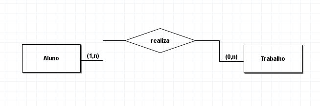

## DB 02 - DER
#### 2. Um diretor no mínimo um departamento e no máximo um departamento. Um departamento tem no mínimo um diretor e no máximo um diretor. 

Após a conclusão, desenvolva o Diagrama Entidade Relacionamento

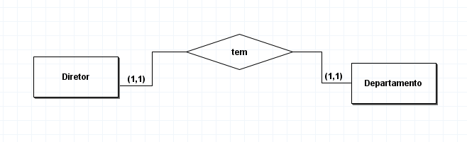

## DB 03 - DER
#### 3. Um autor escreve vários livros, mas ele pode não ter nenhum livro escrito. Um livro pode ser escrito por vários autores, mas pode ter livro sem autor. 

Após a conclusão, desenvolva o Diagrama Entidade Relacionamento

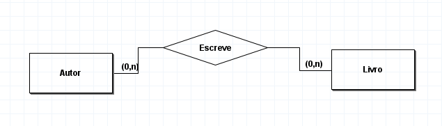

## DB 04 - DER
#### 4. Uma equipe é composta por vários jogadores, e  pode existir equipe sem jogador. Um jogador joga apenas em uma equipe, pode ter jogador sem equipe. 

Após a conclusão, desenvolva o Diagrama Entidade Relacionamento

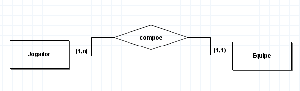

## DB 05 - DER
#### 5. Um cliente realiza nenhuma ou várias encomendas. Uma encomenda diz respeito sempre a aum cliente apenas a um cliente.

Após a conclusão, desenvolva o Diagrama Entidade Relacionamento

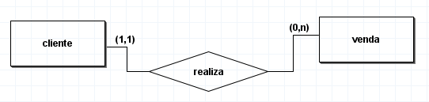

 17/03/25 

 💠 Aula 23 - 📝 Banco de Dados - Modelo Conteitual II (6 e 7)

 

 17/03/25 

## BD 06 - Berçário

#### Um berçário deseja informatizar suas operações. 
Quando um bebê nasce, algumas informações são armazenadas sobre ele, tais como: 
- nome
- data do nascimento 
- peso do nascimento
- altura
- mãe deste bebê
- médico que fez seu parto.

Para as mães, o berçário também deseja manter um controle, guardando informações como:
- nome
- endereço 
- telefone
- data de nascimento
  
Para os médicos, é importante saber: 
- CRM
- nome
- telefone
- celular
- especialidade

1. Liste as entidades que você identificou
2. Liste os relacionamentos entre as entidades 
3. Liste os atributos de cada entidade
4. Definir as chaves primarias das entidades
5. Crie o Diagrama Entidade Relacionamento

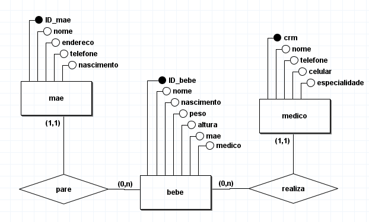

## DER 07 - floricultura

#### Uma floricultura deseja informatizar suas operações. 

Inicialmente, deseja manter um cadastro de todos os seus clientes, mantendo informações como: 
- RG
- nome
- telefone
- endereço. 

Deseja também manter um cadastro contendo informações sobre os produtos que vende, tais como: 
- nome do produto
- tipo (flor,vaso, planta,...)
- preço
- quantidade em estoque. 

Além disso, a floricultura pretende registrar os pedidos realizados pelos clientes, incluindo a data do pedido e o valor total. Cada pedido estará associado a um cliente específico

- Um cliente pode ter zero ou mais pedidos.
- Um pedido deve estar associado a um cliente.
- Um pedido pode conter um ou mais produtos.
- Um produto pode estar presente em zero ou mais pedidos.

1. Liste as entidades que você identificou. 
2. Liste os relacionamentos entre as entidades.
3. Atribua o grau de relacionamento(Cardinalidade)
4. Liste os atributos de cada entidade
5. Defina as chaves primárias e estrangeiras
6. Crie o Diagrama Entidade Relacionamento

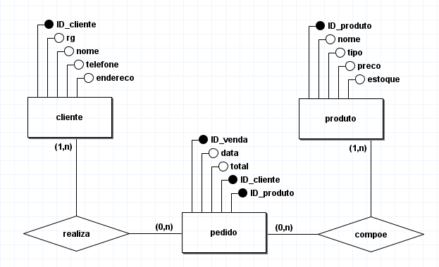

 

 18/03/25 

 18/03/25 

 💠 Aula 24 - 📝 Banco de Dados - Modelo Conteitual III (8)

 

 19/03/25 

## BD 08 - Empresa
#### Situação: Você está trabalhando em um projeto para uma empresa que deseja rastrear a hierarquia de funcionários. 

Cada funcionário pode ter um supervisor que também é um funcionário na mesma empresa. Como você estruturaria o banco de dados para representar essa relação entre os funcionários?

Funcionário gerencia um ou mais funcionários

Funcionário é gerenciado por um ou nenhum funcionáro

- Entidades: Funcionário
- Auto-Relacionamento: Funcionário pode ser supervisor de outros Funcionários
- Funcionário: ID_Funcionário (PK), Nome, Cargo, Supervisor_ID (FK - referenciando ID_Funcionário na mesma tabela)

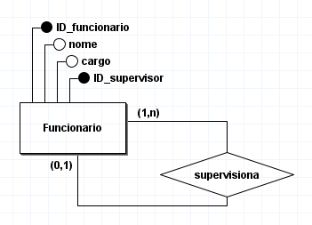

## BD 09 - Concessionária
#### Você está projetando um sistema para uma concessionária de veículos. Eles desejam armazenar informações sobre os veículos em seu estoque, que incluem carros e caminhões. Cada veículo possui informações gerais, mas carros e caminhões têm atributos específicos. Como você estruturaria o banco de dados para atender a esses requisitos?

O Diagrama de Entidade-Relacionamento (DER) mostraria a tabela "Veículo" como a entidade 
principal, com linhas para "Carro" e "Caminhão" conectadas a ela com linhas de especialização.
Especialização:

Entidades:
- Veículo
- Carro
- Caminhão

Relacionamentos:

Especialização: 
- Veículo se especializa em Carro e Caminhão
Atributos:
- Veículo: ID_Veículo (PK), Marca, Modelo, Ano, etc.
- Carro: ID_Carro (PK, FK referenciando Veículo), Número de
- Portas, Cor, etc.
- Caminhão: ID_Caminhão (PK, FK referenciando Veículo), Tipo de Carroceria, Capacidade de Carga, etc.

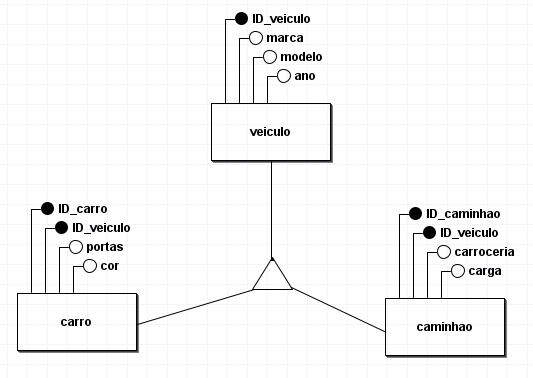

## BD 10 - Normalização
#### Uma pequena empresa de varejo está desenvolvendo um sistema de gerenciamento de funcionários. Neste sistema, há uma tabela de funcionários que armazena informações essenciais sobre sua equipe. 

A empresa tem vendedores, caixas, gerentes de departamento, entre outros. 

Cada funcionário é identificado por um ID único e tem um nome. Além disso, cada um ocupa um cargo específico, como vendedor ou caixa, e está vinculado a um departamento específico da loja, como departamento de vestuário ou eletrônicos. Cada funcionário recebe um salário mensal fixo.

Além das informações básicas, cada funcionário possui um número de telefone para contato e um endereço de residência registrado na empresa.

Situação Inicial (Antes da Normalização):
Tabela de Funcionários:
- ID_Funcionario (PK)
- Nome
- Cargo
- Departamento
- Salário
- Telefone
- Endereço

A empresa de varejo decidiu informatizar o gerenciamento de funcionários, mas descobriu que o banco de dados existente está inconsistente e não normalizado. Isso resulta em várias anomalias e dificuldades de manutenção, como redundância de dados, dependências transitivas e dificuldade em atualizar informações. Você foi solicitado para efetuar melhorias no sistema existente, qual seria a sugestão de melhoria.

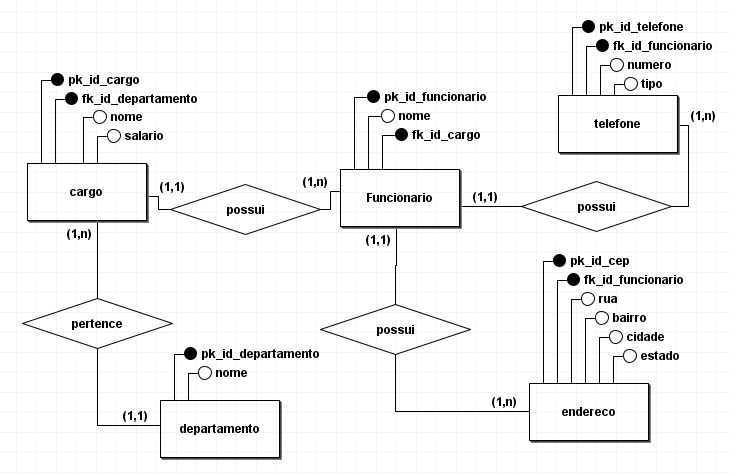

 19/03/25 

 💠 Aula 25 - 📝 Banco de Dados - Modelo Físico 

 

 20/03/25 

## Modelo físico

Criação do modelo físico 

~~~~ sql
create schema turma;
use turma;

create table aluno(
	id_aluno int auto_increment primary key,
	nome varchar(150) not null
);

create table trabalho(
	id_trabalho int auto_increment primary key,
	descricao varchar(255) not null,
	id_aluno int not null,
		foreign key (id_aluno) references aluno(id_aluno)
);
~~~~ 

## Exercicio

Você foi contratado para projetar um `banco de dados` para uma empresa que gerencia clientes e pedidos. Sua tarefa é desenvolver os modelos: 
- conceitual,
- lógico,
- físico.

Vamos criar duas entidades: **Cliente** e **Pedido**, e um relacionamento entre elas.

Campos: Cliente
- id_cliente (chave primária), 
- nome_cliente.
- Pedido

Campos: Pedido
- id_pedido (chave primária), 
- descricao_pedido.

Um cliente pode fazer vários pedidos

Um pedido está relacionado somente a um cliente.

#### Modelagem Conceitual
Desenhe um diagrama entidade-relacionamento (DER) representando as entidades Cliente e Pedido e o relacionamento entre elas.

#### Modelagem Lógica

Converta o diagrama entidade-relacionamento (DER) em um modelo relacional. Liste as tabelas necessárias, seus atributos e as chaves primárias e estrangeiras.

#### Modelagem Física

Utilizando SQL, crie as tabelas correspondentes ao modelo relacional definido na etapa de modelagem lógica.

Insira alguns dados de exemplo nas tabelas para testar o banco de dados.

##### Observações

Certifique-se de definir corretamente as chaves primárias e estrangeiras para manter a integridade dos dados.

Verifique se os tipos de dados escolhidos para cada atributo são apropriados para os dados que serão armazenados.

Ao criar o modelo físico, preste atenção aos detalhes de sintaxe SQL específicos do sistema de gerenciamento de banco de dados (SGBD) que você está utilizando.

### Modelo Conceitual
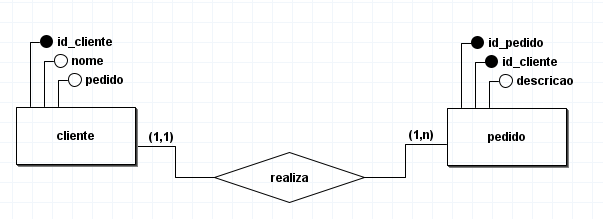

### Modelo Lógico
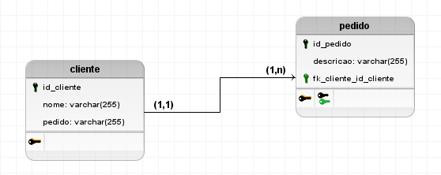

### Modelo Físico
~~~~ sql
create schema Exercicio;
use Exercicio;

create table cliente(
	id_cliente int auto_increment primary key,
	nome varchar(150),
	pedido varchar(200)
);

create table pedido(
	id_pedido int auto_increment primary key,
	descricao varchar(255),
	id_cliente int not null,
		foreign key (id_cliente) references cliente(id_cliente)
);

~~~~

 20/03/25 

 💠 Aula 26 - 📝 Banco de Dados - Modelo Físico II 

 

 21/03/25 

## Atividade I - INSERT 

Nesta atividade, você realizará um teste do banco de dados que foi criado anteriormente. O teste envolverá a inserção de dados de exemplo nas tabelas Clientes e Pedidos, permitindo verificar se o banco de dados está funcionando conforme o esperado.

 - Objetivo
   - Inserir dados de exemplo para testar o banco de dados.

#### Instruções
Inserção de Dados:
Insira os seguintes dados de exemplo nas tabelas Clientes e Pedidos do banco de dados:
- Três Clientes.
- Quatro Pedidos.

Inserção de Dados:

Ao utilizar o comando INSERT INTO e especificar as colunas, você pode inserir valores apenas para as colunas desejadas.

~~~~ sql
INSERT INTO nomeDaTabela (coluna1, coluna2, coluna3) VALUES (valor1, valor2, valor3);
~~~~

Neste exemplo, estamos inserindo valores apenas para as colunas coluna1, coluna2 e coluna3.

~~~~ sql
create schema Exercicio;
use Exercicio;

create table cliente(
	id_cliente int auto_increment primary key,
	nome varchar(150),
	pedido varchar(200)
);

create table pedido(
	id_pedido int auto_increment primary key,
	descricao varchar(255),
	id_cliente int not null,
		foreign key (id_cliente) references cliente(id_cliente)
);

insert into cliente(nome, pedido) values
("Thiago", "Notebook"),
("Thais", "Monitor"),
("Thalles", "Teclado");

insert into pedido(descricao, id_cliente) values
("Asus vivobook GO 15", 1),
("Dell monitor", 2),
("Teclado RGB horus", 3),
("Mousepad 70x30cm COD", 3);
~~~~ 

## Atividade II - ALTER TABLE - ADD COLUMN

Adição de Nova Coluna para Pontos de Fidelidade

Realizaremos essa atividade prática para explorar como fazer alterações em um banco de dados MySQL. Nosso objetivo é adicionar uma nova coluna para acompanhar os pontos de fidelidade dos clientes na tabela já existente (cliente). Sempre que um cliente for adicionado, por padrão será atribuído o valor zero para a nova coluna criada.

> Objetivo:
> 
> Compreender e praticar a adição de uma nova coluna a uma tabela existente em um banco de dados MySQL.
Reconhecer a importância de planejar e executar alterações no esquema do banco de dados para atender às necessidades do sistema.
Novos campos da Tabela Cliente:

#### Cliente
- id_cliente (chave primária),
- nome_cliente
- pontos_fidelidade

#### Instruções

Sem valor padrão:
~~~~ sql
ALTER TABLE nomeTabela
ADD COLUMN novoNomeColuna VARCHAR(20);
~~~~

#### Com valor padrão(DEFAULT):
~~~~ sql
ALTER TABLE nomeTabela
ADD COLUMN novoNovemColuna VARCHAR(20) DEFAULT 'regular';
~~~~

## Atividade III - ALTER TABLE - MODIFY

Modificação de Coluna para Adicionar Restrição `NOT NULL`
Nesta atividade prática, exploraremos como fazer alterações em um banco de dados MySQL. 

Nosso objetivo é modificar uma coluna existente na tabela pedido para adicionar uma restrição NOT NULL. Esta coluna foi originalmente criada sem a restrição e agora vamos garantir que não aceite valores nulos.

#### Instruções
~~~~ sql
ALTER TABLE pedido
MODIFY quantidade int NOT NULL;
~~~~

## Atividade IV - livros e autores

Você foi contratado para criar o projeto conceitual e lógico de um banco de dados para uma biblioteca online. A biblioteca precisa armazenar informações sobre os livros disponíveis e seus respectivos autores.

Requisitos do Sistema

- Tabelas
- Livros
- Autores
- Cardinalidade

1. Livros
     - Cada livro deve ter um título, ano de publicação e gênero.
  
2. Autores
   - Cada autor deve ter um nome e país de origem.

3. Relacionamento
    - Um livro pode ter apenas um autor, mas um autor pode ter escrito vários livros.
  
    - Nem todos os livros precisam estar associados a um autor, permitindo a existência de livros sem autores registrados.
  
    - Nem todos os autores precisam estar associados a livros, permitindo a existência de autores sem livros registrados.

- Atributos Livros:
    - livro_id (PK, INT)
    - titulo (VARCHAR)
    - ano_publicacao (INT)
    - genero (VARCHAR)
    - autor_id (FK, INT, NULL)

- Atributos Autores:
    - autor_id (PK, INT)
    - nome (VARCHAR)
    - pais_origem (VARCHAR

Especificar as Chaves Primárias e Estrangeiras:

#### Entregáveis
1. Modelo Conceitual:
   - Diagrama ER mostrando as entidades, atributos e relacionamentos, incluindo a cardinalidade.
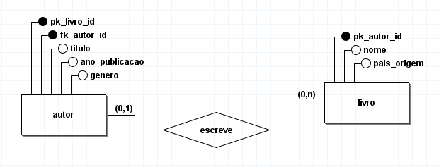

2. Modelo Lógico:
    - Descrição das tabelas e seus campos.
    - Especificação das chaves primárias e estrangeiras.
    - Definição dos tipos de dados e restrições para cada campo.
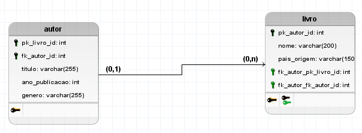

3. Projeto Físico
~~~~ sql
create schema biblioteca;

use biblioteca;

create table autor (
	autor_id int,
	nome varchar(255),
	pais_origem varchar(150),
		primary key (autor_id)
);

create table livro (
	livro_id int,
	titulo varchar(255),
	ano_publicacao int,
	genero varchar(200),
	autor_id int,
		primary key (livro_id),
		foreign key (autor_id) references autor(autor_id)
);
~~~~

## Atividade V - Nota Fiscal

1. Crie, no seu banco de dados, a tabela abaixo, insira os valores apresentados e em
seguida escreva as consultas solicitadas abaixo.
OBS: Os valores em branco devem ser nulos no banco de dados.

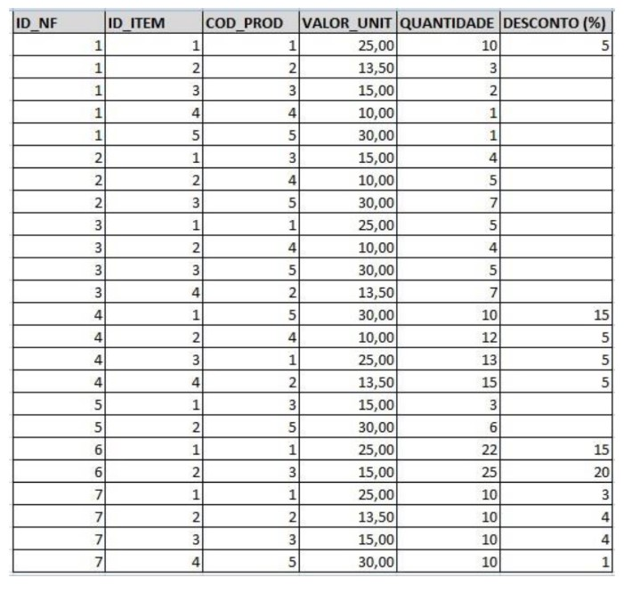

a) Pesquise os itens que foram vendidos sem desconto. As colunas presentes no resultado
da consulta são: `ID_NF`, `ID_ITEM`, `COD_PROD` E `VALOR_UNIT`.

~~~~ sql
select 
	id_nf, 
	id_item, 
	cod_prod, 
	valor_unit 
from registro 
	where desconto is null;
~~~~

b) Pesquise os itens que foram vendidos com desconto. As colunas presentes no resultado
da consulta são: 
    
`ID_NF, ID_ITEM, COD_PROD, VALOR_UNIT` 
    
E O **VALOR VENDIDO**. OBS: O valor vendido é igual a:
    
`VALOR_UNIT -(VALOR_UNIT*(DESCONTO/100))`.
~~~~ sql
select 
	id_nf, 
	id_item, 
	cod_prod, 
	valor_unit,
	valor_unit - (valor_unit * (desconto / 100)) as 'valor vendido'
from registro 
	where desconto is not null;
~~~~ 

c) Altere o valor do desconto (para zero) de todos os registros onde este campo é nulo.
~~~~ sql
update 
	registro 
		set desconto = 0 
where desconto is null;

select * from registro;
~~~~ 

d) Pesquise os itens que foram vendidos. As colunas presentes no resultado da consulta
são: 
    
`ID_NF, ID_ITEM, COD_PROD, VALOR_UNIT, VALOR_TOTAL, DESCONTO, VALOR_VENDIDO.`

OBS: O **VALOR_TOTAL** é obtido pela fórmula: 

`QUANTIDADE * VALOR_UNIT`. 

O **VALOR_VENDIDO** é igual a:

 `VALOR_UNIT - (VALOR_UNIT*(DESCONTO/100))`.

 ~~~~ sql
 select
	id_nf, 
	id_item, 
	cod_prod, 
	valor_unit,
	(quantidade * valor_unit) as 'Valor total',
	(valor_unit - (valor_unit * (desconto / 100))) as 'valor vendido'
from registro;
 ~~~~ 

e) Pesquise o valor total das NF e ordene o resultado do maior valor para o menor. 
As colunas presentes no resultado da consulta são: `ID_NF, VALOR_TOTAL`. OBS: O **VALOR_TOTAL** é obtido pela fórmula: `∑ QUANTIDADE * VALOR_UNIT`. Agrupe o
resultado da consulta por ID_NF.
~~~~ sql
select 
	id_nf,
	sum(quantidade * valor_unit) as 'Valor total'
	from registro 
		group by id_nf
			order by id_nf asc;
~~~~
f) Pesquise o valor vendido das NF e ordene o resultado do maior valor para o menor. As
colunas presentes no resultado da consulta são: ID_NF, VALOR_VENDIDO. OBS:

O **VALOR_TOTAL** é obtido pela fórmula: 

`∑ QUANTIDADE * VALOR_UNIT`. 

O **VALOR_VENDIDO** é igual a `∑ VALOR_UNIT - (VALOR_UNIT*(DESCONTO/100))`. 

Agrupe o resultado da consulta por ID_NF.
~~~~ sql
select
	id_nf,
	(sum(valor_unit - (valor_unit * (desconto / 100)))) as 'valor vendido'	
from registro
group by 1
order by 2 desc;
~~~~ 

g) Consulte o produto que mais vendeu no geral. As colunas presentes no resultado da
consulta são: COD_PROD, QUANTIDADE. Agrupe o resultado da consulta por
COD_PROD.
~~~~ sql
select
	cod_prod,
	sum(quantidade) as Quantidade
from registro
group by cod_prod;
~~~~ 

h) Consulte as NF que foram vendidas mais de 10 unidades de pelo menos um produto. As
colunas presentes no resultado da consulta são: ID_NF, COD_PROD, QUANTIDADE.
Agrupe o resultado da consulta por ID_NF, COD_PROD.
~~~~ sql
select 
	id_nf,
	cod_prod,
		(sum(valor_unit - (valor_unit * (desconto / 100)))) as 'valor vendido'
		from registro
	group by 1, 2
having (sum(valor_unit - (valor_unit * (desconto / 100)))) > 10;
~~~~
i) Pesquise o valor total das NF, onde esse valor seja maior que 500, e ordene o resultado
do maior valor para o menor. As colunas presentes no resultado da consulta são: ID_NF,
VALOR_TOT. OBS: O VALOR_TOTAL é obtido pela fórmula: `∑ QUANTIDADE *
VALOR_UNIT`. Agrupe o resultado da consulta por ID_NF.
~~~~ sql
select
	id_nf,
	sum(quantidade * valor_unit) as 'valor total'
	from registro
group by 1
	having sum(quantidade * valor_unit) > 500;
~~~~
j) Qual o valor médio dos descontos dados por produto. As colunas presentes no resultado
da consulta são: COD_PROD, MEDIA. Agrupe o resultado da consulta por COD_PROD.
~~~~ sql
select 
	cod_prod,
	round(avg(valor_unit - (valor_unit * (desconto / 100))),2) as 'Média Vendas'
from registro
	group by 1;
~~~~
k) Qual o menor, maior e o valor médio dos descontos dados por produto. As colunas
presentes no resultado da consulta são: COD_PROD, MENOR, MAIOR, MEDIA. Agrupe o
resultado da consulta por COD_PROD.
~~~~ sql
select 
	cod_prod,
	MIN(desconto) as 'Menor desconto',
	MAX(desconto) as 'Maior desconto',
	AVG(desconto) as 'Média desconto'
from registro
group by 1;
~~~~
l) Quais as NF que possuem mais de 3 itens vendidos. As colunas presentes no resultado
da consulta são: ID_NF, QTD_ITENS. OBS:: NÃO ESTÁ RELACIONADO A QUANTIDADE
VENDIDA DO ITEM E SIM A QUANTIDADE DE ITENS POR NOTA FISCAL. Agrupe o
resultado da consulta por ID_NF.
~~~~ sql
select 
	id_nf,
	count(quantidade) as 'Quantidade Itens'
from registro 
group by 1;
~~~~ 

 21/03/25 

 💠 Aula 27 - 📝 Banco de Dados - Modelo Físico III 

 

 25/03/25 

## Desafio BD 01

m) Identificação de Itens com e sem Desconto Utilizando IF:

Identifique os itens vendidos, indicando se cada item possui ou não desconto. Utilize a função IF para esta distinção.

As colunas presentes no resultado da consulta são: 
- **ID_NF** (Identificador da Nota Fiscal)
- **ID_ITEM** (Identificador do Item)
- **COD_PROD** (Código do Produto)
- **VALOR_UNIT** (Valor Unitário do Produto)
- **QUANTIDADE** (Quantidade Vendida)
- **STATUS_DESCONTO** (Indicação de Desconto)
- **VALOR_VENDIDO** (Valor Vendido Considerando o Desconto, se aplicável).

~~~~ sql
select 
	id_nf,
	id_item,
	cod_prod,
	valor_unit,
	quantidade,
		if(desconto > 0, 'Com desconto', 'Sem deconto') as 'status desconto',
	(sum(valor_unit - (valor_unit * (desconto / 100)))) as 'valor vendido'
from registro
group by 1, 2, 3;
~~~~ 

## Desafio BD 02

n) Listar itens e indicar se a quantidade vendida é maior ou igual a 10.

Liste os itens vendidos, indicando se a quantidade vendida de cada item é maior ou igual a 10.

Utilize a função `IF` para esta distinção. As colunas presentes no resultado da consulta são:
- **ID_NF** (Identificador da Nota Fiscal)
- **ID_ITEM** (Identificador do Item)
- **COD_PROD** (Código do Produto)
- **QUANTIDADE** (Quantidade Vendida) 
- **QUANTIDADE_STATUS** (Status da Quantidade Vendida).

Os status possíveis para quantidade são **"Quantidade Alta" (>= 10) e "Quantidade Baixa" (< 10)**.

~~~~ sql
select
	id_nf,
	id_item,
	cod_prod,
	quantidade,
		if(quantidade >= 10, 'Quantidade Alta', 'Quantidade Baixa') as 'Quantidade status'
from registro;
~~~~

## Desafio BD 03

O) Listar itens e indicar se o desconto aplicado é maior, igual ou menor que a média geral dos descontos.

Liste os itens vendidos, indicando se o desconto aplicado em cada item é maior, igual ou menor que a média geral dos descontos.
Utilize a função **IF** para esta distinção. As colunas presentes no resultado da consulta são:
- **ID_NF** (Identificador da Nota Fiscal)
- **ID_ITEM** (Identificador do Item)
- **COD_PROD** (Código do Produto)
- **DESCONTO** (Percentual de Desconto)
- **DESCONTO_STATUS** (Status do Desconto).

Os status possíveis para o desconto são **"Desconto Acima da Média", "Desconto Médio" e "Desconto Abaixo da Média"**

~~~~ sql
select
	id_nf,
	id_item,
	cod_prod,
	desconto,
		if(desconto > (select avg(desconto) from registro), 'Desconto Acima da Média',
			if(desconto = (select avg(desconto) from registro), 'Desconto Médio',
				if(desconto < (select avg(desconto) from registro) and desconto > 0, 'Desconto Abaixo da Média', 'Sem desconto'))) as 'desconto status'
	from registro;
~~~~ 
---
## Universidade

1. Crie uma base de dados Universidade com as tabelas a seguir:

- Alunos (<u>MAT</u>, nome, endereço, cidade)
- Disciplinas (<u>COD_DISC</u>, nome_disc, carga_hor)
- Professores (<u>COD_PROF</u>, nome, endereço, cidade)
- Turma (<u>COD_DISC, COD_TURMA, COD_PROF, ANO</u>, horário)
    - COD_DISC referencia Disciplinas
    - COD_PROF referencia Professores
- Histórico (<u>MAT, COD_DISC, COD_TURMA, COD_PROF, ANO</u>, frequência, nota)
  - MAT referencia Alunos
  - COD_DISC, COD_TURMA, COD_PROF, ANO referencia Turma

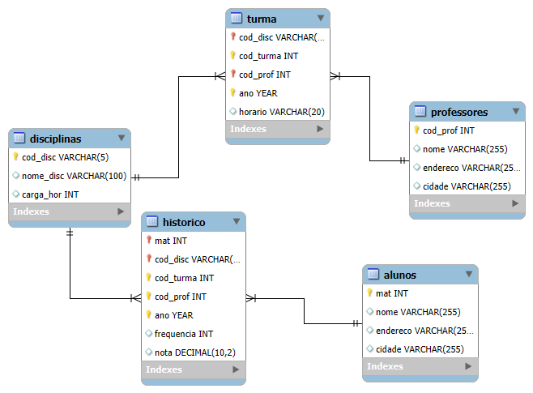

INSIRA OS SEGUINTES REGISTROS:
ALUNOS:
~~~~ sql
(2015010101, "JORGE DE ALENCAR", "RUA DAS ALMAS", "NATAL"),
(2015010102, "JOÃO PAULO", "AVENIDA RUY CARNEIRO", "JOÃO PESSOA"),
(2015010103, "MARINA", "RUA CARROSSEL", "RECIFE"),
(2015010104, "MARIA DAS DORES", "RUA DAS LADEIRAS", "FORTALEZA"),
(2015010105, "JOSUÉ EDUARDO DOS SANTOS", "CENTRO", "NATAL"),
(2015010106, "JOSUÉLISSON CLAUDINO DOS SANTOS", "CENTRO", "NATAL");
~~~~ 

DISCIPLINAS:
~~~~ sql
("BD", "BANCO DE DADOS", 100),
("POO", "PROGRAMAÇÃO COM ACESSO A BANCO DE DADOS", 100),
("WEB", "AUTORIA WEB", 50),
("ENG", "ENGENHARIA DE SOFTWARE", 80);
~~~~ 

PROFESSORES:
~~~~ sql
(212131, "NICKERSON FERREIRA", "RUA MANAÍRA", "JOÃO PESSOA"),
(122135, "ADORILSON BEZERRA", "AVENIDA SALGADO FILHO", "NATAL"),
(192011, "DIEGO OLIVEIRA", "AVENIDA ROBERTO FREIRE", "NATAL");
~~~~

TURMA:
~~~~ sql
("BD", 1, 212131, 2015, "11H-12H"),
("BD", 2, 212131, 2015, "13H-14H"),
("POO", 1, 192011, 2015, "08H-09H"),
("WEB", 1, 192011, 2015, "07H-08H"),
("ENG", 1, 122135, 2015, "10H-11H");
~~~~

HISTÓRICO:  

INSIRA VALORES PARA TODOS OS ALUNOS EM TODAS AS DISCIPLINAS  
    
A) Encontre a MAT dos alunos com nota em BD em 2015 menor que 5 (obs: BD = 
código da disciplina).  
~~~~ sql
select 
	mat,
	nota
from historico
where cod_disc = 'BD' 
		and ano = 2015 
			and nota < 5;
~~~~ 

B) Encontre a MAT e calcule a média das notas dos alunos na disciplina de POO 
em 2015.  
~~~~ sql
select 
	mat,
	avg(nota)
from historico
where cod_disc = 'POO' 
	and ano = 2015
group by mat;
~~~~

C) Encontre a MAT e calcule a média das notas dos alunos na disciplina de POO 
em 2015 e que esta média seja superior a 6.  
~~~~ sql
select
	mat,
	avg(nota) as média
from historico
where cod_disc = 'POO'
	and ano = 2015
group by 1
having avg(nota) > 6;
~~~~ 
D) Encontre quantos alunos não são de Natal.  
~~~~ sql
select 
	* 
from alunos 
	where cidade != 'NATAL';
~~~~
---

## DER MODELO LÓGICO 

 25/03/25 

 💠 Aula 28 - 📝 Banco de Dados - Modelo Físico IV 

 

 26/03/25 

### Universidade Parte 2
1. INSERIR OS DADOS NO BANCO DE DADOS DB_UNIVERSIDADE  
  
- a) CADASTRAR 4 ALUNOS NO BANCO DE DADOS DA UNIVERSIDADE;  
~~~~ sql
insert into alunos (mat,nome,endereco,cidade) values
(2015010107, 'AUGUSTO ALEGRE','RUA MANGUEIRÃO','BELÉM'),
(2015010108, 'PEDRO ROCHA','AVENIDA NAZARÉ','BELÉM'),
(2015010109, 'ALEXA DIAS','TAGUATINGA','BRASÍLIA'),
(2015010110, 'RAISSA ANDREIA','SAMAMBAIA','BRASÍLIA');
~~~~
- b) CADASTRAR PROFESSORES PARA AS DISCIPLINAS DE WEB E ENG, QUE SERÃO  
ATRIBUÍDOS A TURMA 2;  
~~~~ sql
insert into professores (cod_prof, nome, endereco, cidade) values
(777888,'ANTONIO SOARES','RIACHO FUNDO II','BRASÍLIA'),
(121721,'THIAGO ANTONIO','RIACHO FUNDO I','BRASÍLIA'),
(123968,'BRENA COSTA','NÚCLEO BANDEIRANTE','BRASÍLIA');

insert into turma(cod_disc, cod_turma, cod_prof, ano, horario) values 
('WEB',2,777888,2025,'9H-10H'),
('ENG',2,121721,2025,'12H-13H'),
('POO',2,123968,2025,'10H-11H');
~~~~
- c) INSERIR OS DADOS DOS 4 ALUNOS NO HISTÓRICO:  
  - PERTENCEM A TURMA 02  
  - ESTÃO CURSANDO AS MATÉRIAS DE: BD, WEB E ENG(CERTIFICAR QUE TEM 
PROFESSORES CADASTRADOS EM TODAS ESSAS DISCIPLINAS NA TURMA 2).  
~~~~ sql
insert into historico(mat, cod_disc, cod_turma, cod_prof, ano, frequencia, nota) values
(2015010107,'POO',2,123968,2025,8,8.8),
(2015010107,'WEB',2,777888,2025,9,7.8),
(2015010108,'ENG',2,121721,2025,5,5.4),
(2015010109,'WEB',2,777888,2025,10,8.0),
(2015010110,'ENG',2,121721,2025,7,9.2);
~~~~
  
1. DELETE   
- a) EXCLUIR TODOS OS ALUNOS QUE FORAM MATRICULADOS NA TURMA 2 E QUE ESTÃO 
CURSANDO A MATÉRIA DE BANCO DE DADOS.  
~~~~ sql
delete from historico where cod_turma = 2 and cod_disc = 'BD';
~~~~
  
- b) EXCLUIR TODOS OS REGISTROS DE ALUNOS QUE FORAM INSERIDOS APÓS A 
MATRÍCULA 2015010109.  
~~~~ sql 
 -- delete from alunos where mat > 2015010109; ERRO DE FK
-- update alunos set mat = 0 where mat > 2015010109; ERRO DE FK
update alunos set nome = null, endereco = null, cidade = null where mat > 2015010109;
select * from alunos where mat > 2015010109;
~~~~ 

1. UPDATE  
- a) ALTERAR A NOTA DE TODOS OS ALUNOS DA DISCIPLINA DE ENG MATRICULADOS NA 
TURMA 2, ACRESCENTAR 0,5 NAS NOTAS.  
~~~~ sql
update historico set nota = nota + 0.5 where cod_disc = 'ENG' and cod_turma = 2;

select nota from historico where cod_disc = 'ENG' and cod_turma = 2;
~~~~
  
- b) ALTERAR A NOTA DO ALUNO JOÃO PAULO DA DISCIPLINA DE POO PARA 10 E DEPOIS  
REALIZE UMA CONSULTA PARA SABER SE O RESULTADO FOI ALTERADO 
CORRETAMENTE;
~~~~ sql  
update historico set nota = 10 where mat = 2015010102 and cod_disc = "POO";

select 
	mat, 
	nota
from historico
	where mat = 2015010102 and cod_disc like "POO";
~~~~  

 26/03/25 

 💠 Aula 29 - 📝 Banco de Dados - Modelo Físico V 

 

 27/03/25 

SUBCONSULTA COM MAIS DE UMA TABELA 

### Universidade Parte 3
### Fazer um relatório para mostrar o nome dos alunos da disciplina de 
banco de dados 
~~~~ sql
 SELECT NOME FROM ALUNO WHERE MAT IN (SELECT MAT FROM 
HISTORICO WHERE COD_DISC = 'BD'); 
~~~~

1. Fazer um relatório para mostrar os dados dos alunos que tiraram 
nota = 10. 
~~~~ sql
-- SUBSELECT
select 
	mat,
	nome,
	endereco,
	cidade
from alunos 
	where mat in (
	select 
		mat
	from historico
		where nota = 10);
-- com JOIN
select 
	* 
from alunos a  
	inner join historico h
		on a.mat = h.mat
where h.nota = 10;
~~~~

2. Fazer um relatório que mostre todos os dados do aluno e do 
histórico, quando a nota for maior que 7. 
~~~~ sql
-- SUBSELECT
select 
	* 
from alunos 
	where mat in (
	select 
		mat
	from historico 
		where nota >7);

-- com JOIN
select
	*
from alunos a 
	inner join historico h
		on a.mat = h.mat 
	where nota > 7;

~~~~

3. Fazer um relatório que mostre o nome dos professores e a 
quantidade de turmas que eles ministram aula, somente para 
quando a quantidade de turmas for maior que 1. 
~~~~ sql
select
	p.nome,
	count(cod_turma) as turmas
from professores p
	inner join turma t
		on p.cod_prof = t.cod_prof
group by 1
having count(cod_turma) > 1;
~~~~ 

4. Fazer um relatório para mostrar o nome dos alunos, o código da 
disciplina, a nota e a média geral, mostrar somente os dados dos 
alunos que tiraram nota com valor maior ou igual a média geral.
~~~~ sql
select 
	a.nome,
	d.cod_disc,
	avg(h.nota), 
	round((select avg(h.nota) from historico h)) as "media geral"
from alunos a
	inner join historico h
		on a.mat = h.mat
	inner join disciplinas d
		on d.cod_disc = h.cod_disc
group by 1, 2;
~~~~ 

 27/03/25 

 💠 Aula 30 - 📝 Banco de Dados - INNER JOIN 

 

 28/03/25 

## Exercícios de SQL com INNER JOIN
(Banco de Dados: Universidade)

### 1. Liste o nome dos alunos, a disciplina e a nota, para todos os alunos que tiveram nota maior que 7 em qualquer disciplina no ano de 2015.
~~~~ sql
select
	a.nome, 
	d.nome_disc,
	h.nota
from alunos a
	inner join historico h
		on a.mat = h.mat
	inner join disciplinas d
		on d.cod_disc = h.cod_disc
where nota > 7 and ano = 2015;
~~~~
### 2. Mostre o nome do professor, o nome da disciplina e o horário das turmas que cada professor ministrou em 2015.
~~~~ sql
select
	p.nome,
	d.nome_disc,
	t.horario
from professores p
	inner join turma t
		on p.cod_prof = t.cod_prof
	inner join disciplinas d
		on d.cod_disc = t.cod_disc
where t.ano = 2015;
~~~~
### 3. Encontre todos os alunos que estudaram com o professor Nickerson Ferreira, mostrando o nome do aluno, a disciplina e o ano.
~~~~ sql
select
	a.nome,
	d.nome_disc as disciplina,
	t.ano
	from alunos a
		inner join historico h
			on a.mat = h.mat
		inner join disciplinas d
			on d.cod_disc = h.cod_disc
		inner join turma t
			on d.cod_disc = t.cod_disc
		inner join professores p
			on t.cod_prof = p.cod_prof
where p.nome like "NICKERSON FERREIRA";
~~~~ 

### 4. Liste os alunos de Natal que tiveram frequência menor que 5 em qualquer disciplina, mostrando o nome do aluno, nome da disciplina e a frequência.
~~~~ sql 
select 
	a.nome,
	d.nome_disc,
	h.frequencia
from alunos a
	inner join historico h
		on a.mat = h.mat
	inner join disciplinas d
		on h.cod_disc = d.cod_disc
where a.cidade like "NATAL" and h.frequencia < 5;
~~~~  
### 5. Mostre a média de notas por disciplina para cada cidade de origem dos alunos, ordenado pela disciplina e depois pela média decrescente.
~~~~ sql 
select 
	d.nome_disc,
	a.cidade,
	round(avg(h.nota), 2) as "média"
from alunos a
	inner join historico h
		on a.mat = h.mat
	inner join disciplinas d
		on d.cod_disc = h.cod_disc
group by 1, 2
order by nome_disc and avg(h.nota) desc;
~~~~  

### 6. Encontre os professores que ministraram disciplinas com carga horária superior a 70 horas, mostrando o nome do professor e o nome da disciplina.
~~~~ sql 
select 
	p.nome,
	d.nome_disc as disciplina
from professores p
	join turma t
		on t.cod_prof = p.cod_prof
	join disciplinas d
		on d.cod_disc = t.cod_disc
where d.carga_hor > 70;
~~~~  

### 7. Liste todos os alunos que tiveram nota acima da média em Banco de Dados, mostrando o nome do aluno e a nota.
~~~~ sql 
-- CORRIGIR
select 
	a.nome,
round(avg(h.nota), 2) as nota
from alunos a
	inner join historico h
		on a.mat = h.mat
where h.cod_disc = "BD"
group by 1;
~~~~  

### 8. Mostre a quantidade de alunos por professor em 2015, ordenado pela quantidade em ordem decrescente.
~~~~ sql 
select
	p.nome,
	count(a.mat) as alunos
from alunos a
	inner join historico h
		on a.mat = h.mat
	inner join disciplinas d
		on d.cod_disc = h.cod_disc
	inner join turma t
		on t.cod_disc = d.cod_disc
	inner join professores p
		on p.cod_prof = t.cod_prof
where t.ano = 2015
group by 1
order by 2 desc;
~~~~  

### 9. Encontre os alunos que cursaram mais de uma disciplina com o mesmo professor, mostrando o nome do aluno, nome do professor e a quantidade de disciplinas.
~~~~ sql 
-- CORRIGIR
select
	a.nome as aluno,
	p.nome as professor,
	count(d.cod_disc) as disciplinas
from alunos a
	inner join historico h
		on a.mat = h.mat
	inner join disciplinas d
		on d.cod_disc = h.cod_disc
	inner join turma t
		on t.cod_disc = d.cod_disc
	inner join professores p
		on p.cod_prof = t.cod_prof
where t.ano = 2015 and a.nome is not null
group by 1, 2
having count(d.cod_disc) > 1;
~~~~  

### 10. Liste as disciplinas que tiveram alunos de todas as cidades representadas no banco de dados, mostrando o nome da disciplina.
~~~~ sql 
select
	d.nome_disc as disciplinas,
	a.cidade
from alunos a
	inner join historico h
		on a.mat = h.mat
	inner join disciplinas d
		on d.cod_disc = h.cod_disc
group by 1, 2;
~~~~  

> Observações:
> 
> • Todas as consultas devem utilizar INNER JOIN para relacionar as tabelas.
> 
> • Considere a estrutura do banco de dados "Universidade" conforme definido
anteriormente.

 28/03/25 

 💠 Aula 31 - 📝 Banco de Dados - JOINs

 

 01/04/25 

## Exericio 5 Universidade
## Lista 1: Exercícios com INNER JOIN
1. Liste o nome dos alunos, a disciplina e a nota para alunos com nota > 7 em 2015.

2. Mostre professores, disciplinas e horários das turmas de 2015.

3. Encontre alunos que estudaram com o professor "Nickerson Ferreira".

4. Calcule a média de notas por disciplina e cidade de origem, ordenando por disciplina e média.

5. Liste professores que ministraram disciplinas com carga horária > 70 horas.

## Lista 2: Exercícios com LEFT JOIN
1. Liste todos os alunos e suas disciplinas (incluindo quem não cursou nenhuma).

2. Mostre todos os professores e as disciplinas que ministraram (incluindo quem não ministrou).

3. Liste todas as disciplinas e alunos que as cursaram (incluindo disciplinas sem alunos).

## Lista 3: Exercícios com RIGHT JOIN
1. Mostre todas as disciplinas e seus professores (incluindo disciplinas não
ministradas).

2. Liste registros de histórico com dados completos dos alunos (incluindo
históricos sem aluno, se houver).

## Lista 4: Exercícios com FULL OUTER JOIN (simulado)
1. Liste todos os alunos e todas as disciplinas, mostrando relações existentes.

## Lista 5: Exercícios com CROSS JOIN 
1. Crie uma lista de todas as combinações possíveis entre alunos e disciplinas. 
 
## Lista 6: Exercícios com SELF JOIN 
1. Encontre alunos que moram na mesma cidade (pares distintos). 
 
## Lista 7: Exercícios Combinados (Múltiplos JOINs) 
1. Liste alunos, disciplinas cursadas e professores (incluindo alunos sem 
disciplinas). 
2. Mostre todas as disciplinas, professores que poderiam ministrá-las e turmas já 
formadas. 
3. Liste todas as combinações professor-disciplina, marcando quais já ocorreram. 
 
> Como usar: 
> 1. Para soluções, utilize a estrutura do banco "Universidade" definida anteriormente. 
> 
> 2. Dica: Em MySQL, substitua FULL OUTER JOIN por UNION de LEFT e RIGHT  JOIN. 

 01/04/25 

 💠 Aula 32 - 📝 Banco de Dados - Final I

 

 01/04/25 

## Instruções para o Projeto Final de Banco de Dados – MySQL 
 
### Objetivo do Projeto 
Você deverá criar um sistema bancário completo no MySQL, incluindo: 
1. Criação do banco de dados e tabelas 
2. Inserção de dados de exemplo 
3. Consultas SQL para extrair informações importantes 
4. Normalização de dados - Até a 3° forma normal (Atividade Extra) 
5. Triggers para automatizar processos (Atividade Extra) 
 
### Requisitos Técnicos 
- Todos os scripts devem ser compatíveis com MySQL 
- Use o caractere ; para encerrar cada comando SQL 
- Comente seu código com -- para linhas únicas ou /* */ para blocos 
 
1. Especificações das Tabelas 
#### a. Tabela Clientes 
Armazena informações dos clientes do banco: 
- cliente_id (INT, PK, AUTO_INCREMENT): Identificador único 
- nome : Nome completo do cliente 
- cpf : CPF formatado (ex: 123.456.789-01) 
- data_nascimento (DATE): Data de nascimento 
- telefone Telefone com DDD 
- email E-mail do cliente 
- endereco Endereço completo 
- data_cadastro (DATETIME): Data/hora do cadastro (default 
CURRENT_TIMESTAMP) 

#### Inserir Clientes 
~~~~ sql
INSERT INTO Clientes (nome, cpf, data_nascimento, telefone, email, endereco) 
VALUES 
('João Silva', '123.456.789-01', '1980-05-15', '(11) 98765-4321', 
'joao@email.com', 'Rua A, 100 - Centro'), 
~~~~

#### b. Tabela Agencias
Armazena as agências do banco:
- agencia_id (INT, PK, AUTO_INCREMENT): Identificador único
- nome : Nome da agência
- endereco : Endereço completo
- telefone : Telefone da agência

#### Inserir Agências
~~~~ sql
INSERT INTO Agencias (nome, endereco, telefone) VALUES
('Agência Centro', 'Rua Principal, 123 - Centro', '(11) 1234-5678')
~~~~

### c. Tabela Contas
Armazena as contas bancárias:
- conta_id (INT, PK, AUTO_INCREMENT): Identificador único
- cliente_id : Referência ao cliente
- agencia_id : Referência à agência
- tipo_conta (ENUM): 'Corrente', 'Poupança' ou 'Salário'
- saldo : Saldo atual (default 0.00)
- data_abertura (DATE): Data de abertura da conta
- status (ENUM): 'Ativa', 'Inativa' ou 'Bloqueada' (default 'Ativa')

#### Inserir Contas
~~~~ sql
INSERT INTO Contas (cliente_id, agencia_id, tipo_conta, saldo, data_abertura, status)
VALUES
(1, 1, 'Corrente', 5000.00, '2020-01-10', 'Ativa')
~~~~

#### d. Tabela Transacoes

Registra todas as movimentações financeiras:
- transacao_id (INT, PK, AUTO_INCREMENT): Identificador único
- conta_origem_id (INT, FK, NULL): Conta de origem (NULL para depósitos)
- conta_destino_id (INT, FK, NULL): Conta de destino (NULL para saques)
- tipo_transacao (ENUM): 'Depósito', 'Saque', 'Transferência', 'Pagamento'
- valor Valor da transação
- data_transacao (DATETIME): Data/hora (default CURRENT_TIMESTAMP)
- descricao : Descrição opcional

#### Inserir Transações
~~~~ sql
INSERT INTO Transacoes (conta_origem_id, conta_destino_id, tipo_transacao, valor,
descricao) VALUES
(1, NULL, 'Depósito', 1000.00, 'Depósito inicial'),
(NULL, 2, 'Depósito', 2000.00, 'Depósito inicial')
~~~~

#### e. Tabela Emprestimos
Registra os empréstimos contratados:
- emprestimo_id (INT, PK, AUTO_INCREMENT): Identificador único
- conta_id (INT, FK): Conta associada ao empréstimo
- valor (DECIMAL(15,2)): Valor total do empréstimo
- taxa_juros (DECIMAL(5,2)): Taxa de juros mensal
- parcelas (INT): Número total de parcelas
- valor_parcela (DECIMAL(15,2)): Valor de cada parcela
- data_contratacao (DATE): Data de contratação
- status (ENUM): 'Ativo', 'Quitado', 'Inadimplente' (default 'Ativo')

#### Inserir Empréstimos
~~~~ sql
INSERT INTO Emprestimos (conta_id, valor, taxa_juros, parcelas, valor_parcela,
data_contratacao) VALUES
(1, 10000.00, 1.5, 12, 916.67, '2022-01-15')
~~~~

#### f. Tabela PagamentosEmprestimos
Registra os pagamentos de empréstimos:
- pagamento_id (INT, PK, AUTO_INCREMENT): Identificador único
- emprestimo_id (INT, FK): Empréstimo associado
- numero_parcela : Número da parcela
- valor_pago : Valor efetivamente pago
- data_pagamento : Data do pagamento

#### Inserir Pagamentos de Empréstimos
~~~~ sql
INSERT INTO PagamentosEmprestimos (emprestimo_id, numero_parcela, valor_pago,
data_pagamento) VALUES
(1, 1, 916.67, '2022-02-15')
~~~~

### Parte III

#### 3. Consultas 
- a) Liste todos os clientes com suas contas e saldos totais 
- b) Mostre o saldo médio por tipo de conta 
- c) Liste todas as transações de uma conta específica (use o ID 1 como 
- exemplo) 
- d) Calcule o total de transações por tipo no último mês 
- e) Liste os clientes que têm mais de uma conta 
- f) Mostre o total de empréstimos por agência 
- g) Liste os empréstimos ativos com parcelas em atraso (considerando que hoje 
é a data (Questão extra) 

---
## **Exercícios com Trigger**

Sintaxe da Trigger
~~~~ sql
CREATE TRIGGER nome momento evento(BEFORE (antes)
e AFTER (depois))
ON tabela
FOR EACH ROW
BEGIN
/*corpo do código*/
END
~~~~

### **Os registros NEW e OLD**
Os `triggers`, são executados em conjunto com operações de inclusão
e exclusão, esse acesso é feito através das palavras *NEW* e *OLD*.
A palavra reservada *NEW* dá acesso ao novo registro. Pode-se
acessar as colunas da tabela como atributo do registro *NEW*.
O operador *OLD* dá acesso ao registro que está sendo removido.

#### **DELIMITER //**
altera o delimitador atual para `//`, que no nosso caso é o `;`

### **Exercícios**
1. Criar as tabelas que serão utilizadas
~~~~ sql
CREATE DATABASE Produto;
USE Produto;

CREATE TABLE Produtos (
Codigo VARCHAR(3) PRIMARY KEY,
Descricao VARCHAR(50) UNIQUE,
Estoque INT NOT NULL DEFAULT 0
);

INSERT INTO Produtos VALUES ('001', 'Computador', 15);
INSERT INTO Produtos VALUES ('002', 'Monitor', 25);
INSERT INTO Produtos VALUES ('003', 'Teclado', 45);

CREATE TABLE ItensVenda(
Venda INT,
Cod_Produto VARCHAR(3),
Quantidade INT
);
~~~~

1. Criar um Trigger que ao inserir um registro da tabela
ItensVenda, o estoque do produto referenciado deve ser
alterado na tabela Produtos
~~~~ sql
DELIMITER $
CREATE TRIGGER Tgr_ItensVenda_Insert AFTER INSERT
ON ItensVenda
FOR EACH ROW
BEGIN
UPDATE Produtos SET Estoque = Estoque - NEW.Quantidade
WHERE Codigo = NEW.Cod_Produto;
END$
DELIMITER;
~~~~

#### **Testando os valores do estoque**
~~~~ sql
INSERT INTO ItensVenda VALUES (1, '002',3);
INSERT INTO ItensVenda VALUES (1, '002',1);
INSERT INTO ItensVenda VALUES (1, '003',5);
~~~~

#### 1. Completar a TRIGGER
Criar um Trigger que ao inserir ou excluir um registro
da tabela ItensVenda, o estoque do produto referenciado
deve ser alterado na tabela Produtos
 

 01/04/25 

 💠 Aula 33 - 📝 Banco de Dados - Final II

 

 08/04/25 

### *Instruções para o Projeto Final de Banco de Dados – MySQL*

2. **Trigger**
• Criar: Trigger para atualizar o saldo da conta após uma transação

Após, verifique os saldos atuais das contas que serão usadas nos testes:
~~~~ sql
SELECT conta_id, cliente_id, saldo FROM Contas;
~~~~

### Inserir um depósito na conta 1 (sem conta de origem)
~~~~ sql
INSERT INTO Transacoes (conta_destino_id, tipo_transacao, valor, descricao)
VALUES (1, 'Depósito', 500.00, 'Depósito teste trigger');
~~~~

### Verificar se o saldo foi atualizado
~~~~ sql
SELECT conta_id, saldo FROM Contas WHERE conta_id = 1;
~~~~

 08/04/25 

 💠 Aula 35 - 📝 TKINTER

 

 09/04/25 

# Exercicio 01 - Criando a Primeira tela com Tkinter 
### Importando a biblioteca tkinter
### Usamos 'as tk' para abreviar o nome na hora de usar
~~~ python
import tkinter as tk
~~~

### Criando a janela principal
~~~ python
janela = tk.Tk()  # Tk() é a função que cria a janela principal
~~~

### Definindo um título para a janela
~~~ python
janela.title("Minha Primeira Janela")
~~~

### Definindo o tamanho da janela (largura x altura)
~~~ python
janela.geometry("400x300")
~~~

### Iniciando o loop principal da aplicação
~~~ python
janela.mainloop()  # Isso mantém a janela aberta
~~~
- import tkinter as tk - Importa a biblioteca com um apelido mais curto
- tk.Tk() - Cria a janela principal
- .title() - Define o título da janela
- .geometry() - Define o tamanho (400 pixels de largura, 300 de altura)
- .mainloop() - Mantém a janela aberta e responde a eventos

### Atividade 01:
- Modifique o tamanho da janela para 600x400.

### Resolução:
~~~~ python
import tkinter as tk

janela = tk.Tk()
janela.title("Primeira tela")
janela.geometry("600x400")
janela.mainloop()
~~~~ 

# Exercicio 02 - Button
~~~ python
import tkinter as tk

def dizer_ola():
    print("Olá, Mundo!")  # Isso aparece no terminal, não na janela

janela = tk.Tk()
janela.title("Janela com Botão")

# Criando um botão
botao = tk.Button(
    janela,  # Indica que o botão pertence à janela
    text="Clique aqui",  # Texto que aparece no botão
    command=dizer_ola  # Função que será chamada ao clicar
)

# Empacotando o botão na janela (isso o exibe)
botao.pack()

janela.mainloop()
~~~

### Criamos uma função dizer_ola() que será chamada quando o botão for clicado.
- tk.Button() cria um botão com texto e ação
- .pack() é um gerenciador de layout simples que coloca o widget na janela
### Atividade:
Mostrar no terminal uma frase de saudação, por exemplo: "Bem vindo(a)!"

# Exercício 03 - Tkinter Button
~~~~ python
import tkinter as tk

def dizer_ola():
    # Criando um rótulo (label) para exibir o texto
    label_ola = tk.Label(janela, text="Olá, Mundo!")
    label_ola.pack()

janela = tk.Tk()
janela.title("Olá Mundo na Janela")

botao = tk.Button(janela, text="Clique aqui", command=dizer_ola)
botao.pack()

janela.mainloop()
~~~~
# Exercício 03 - Contador de cliques

### Atividade:
- Personalizar uma mensagem ao clicar em dizer_ola

📘Crie uma janela com um botão e um rótulo. O rótulo deve contar e mostrar quantas vezes o botão foi clicado.

🧭 Instruções:

- Crie uma variável contador começando com 0.
- Toda vez que o botão for clicado, aumente contador em 1.
- Atualize o texto do Label com o novo valor.
- Use a palavra global dentro da função para indicar que você quer usar a variável de fora da função.
~~~~ python
contador = 0
def contar():
     global contador  # permite usar a variável "contador" de fora da função    
     contador += 1    # aumenta o valor em 1    
     label_contador.config(text=f"Cliques: {contador}")
~~~~

### Label mostrando o número de cliques
~~~~ python
label_contador = tk.Label(janela, text="Cliques: 0")
label_contador.pack(pady=10)
~~~~

 09/04/25 

---

 

@2025

